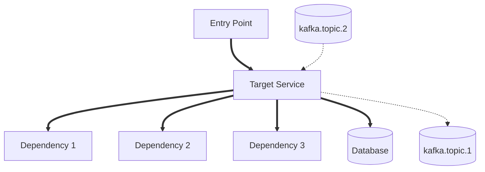
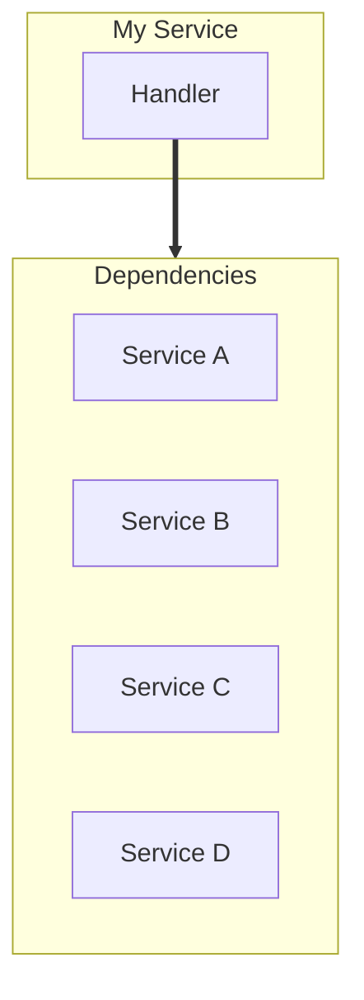

# /flow

Generate professional architectural diagrams through a multi-phase pipeline.

---

## Usage

```
/flow <path> [options]
```

## Options

| Option | Description | Default |
|--------|-------------|---------|
| `--output=<name>` | Output filename (without extension) | `flow-diagram` |
| `--keep-deps` | Keep .flow-deps.yaml after completion | false |

## Output Files

All files are written to the **current working directory**:

| File | Phase | Description |
|------|-------|-------------|
| `{output}.md` | Phase 2 | **Always created** - the diagram source |
| `{output}.png` | Phase 3 | Rendered image (if mermaid-cli installed) |
| `.flow-deps.yaml` | Phase 1 | Intermediate file, deleted on success |

- **Diagram is always generated**, even if validation has issues
- PNG is generated if `@mermaid-js/mermaid-cli` is installed
- `.flow-deps.yaml` is deleted on success, kept on failure (for debugging)
- Use `--keep-deps` to always keep the intermediate file

## Supported Languages

- Go
- Python

---

## Pipeline Overview

```
Phase 1              Phase 2              Phase 3
Discovery    →       Generation   →       Validation + Render + Cleanup
   ↓                     ↓                     ↓
.flow-deps.yaml    flow-diagram.md      Run flowlint
                   (ALWAYS created)       ↓
                                        PASS → render PNG → cleanup
                                          ↓
                                        FAIL → AI reworks → re-validate
                                          ↓
                                        Still FAIL → warn, keep .flow-deps.yaml
```

**Key Principle**:
- Each phase has ONE job
- **Diagram is ALWAYS generated** (Phase 2)
- PNG rendered if mermaid-cli installed
- Validation issues = warnings, not blockers

---

## Phase 1: Discovery

**Goal**: Extract ALL dependencies into `.flow-deps.yaml`

**Instructions**: Follow `prompts/phase1-discovery.md`

### ⛔ CRITICAL: NO FULL REPO SEARCHES

```
╔═══════════════════════════════════════════════════════════════════════╗
║  🚫 NEVER grep/search/find across the entire repository              ║
║  🚫 NEVER use glob patterns like **/*.go at repo root                ║
║  🚫 NEVER read files outside {target_path}/                          ║
║                                                                        ║
║  If you are about to search the whole repo, STOP IMMEDIATELY.        ║
║  This wastes tokens and produces garbage results.                     ║
╚═══════════════════════════════════════════════════════════════════════╝
```

### Critical Rules

1. **ONLY search/read within `{target_path}/`** - nowhere else
2. **Read runbooks/docs FIRST** - they list dependencies explicitly
3. **Every dependency MUST have source_file and source_line**
4. **No abbreviations** - use full names
5. **Follow the MANDATORY file checklist below** - do not skip categories

### 📋 MANDATORY File Checklist

You MUST attempt to find and read ALL of these within `{target_path}/`:

| # | Category | Patterns to Search | Extract |
|---|----------|-------------------|---------|
| 1 | **Docs** | `README.md`, `RUNBOOK.md`, `docs/*.md` | Description, dependencies |
| 2 | **Config** | `config/*.yaml`, `*.yaml`, `.env*` | Topics, URLs, DB strings |
| 3 | **gRPC Clients** | `*client*.go`, `client/*.go` | Outbound gRPC calls |
| 4 | **HTTP Clients** | `*http*.go`, `*api*.go` | Outbound HTTP calls |
| 5 | **Consumers** | `*consumer*.go`, `consumer/*.go` | Kafka topics consumed |
| 6 | **Producers** | `*producer*.go`, `producer/*.go` | Kafka topics produced |
| 7 | **Proto** | `*.proto`, `proto/*.proto` | Service definitions |
| 8 | **Repository** | `*repo*.go`, `*repository*.go`, `store/*.go` | DB connections |
| 9 | **Cache** | `*cache*.go`, `*redis*.go` | Cache connections |
| 10 | **Handlers** | `*handler*.go`, `*server*.go` | Entry points |

**Report which categories you found files for and which were empty.**

### Process

1. Confirm target directory path (ask if not provided)
2. List directory structure: `ls -la {target_path}/`
3. Read documentation files (README, RUNBOOK, docs/)
4. Read configuration files (*.yaml, *.json)
5. **Search within target for each category above**
6. Read all matching files and extract dependencies
7. Write `.flow-deps.yaml` to working directory

### Output

```yaml
version: "1.0"
generated: "2024-01-15T14:30:22Z"
target_service: "ledger-service"
target_path: "services/ledger/"

service:
  name: "Ledger Service"
  description: "..."

dependencies:
  sync:
    - name: "Payment Service"
      type: "grpc"
      source_file: "internal/client/payment_client.go"
      source_line: 45
  async:
    - name: "order.completed"
      type: "kafka"
      direction: "consume"
      source_file: "internal/consumer/order_consumer.go"
      source_line: 27

external:
  - name: "Stripe API"
    source_file: "internal/stripe/client.go"
    source_line: 23

caches:
  - name: "Redis"
    source_file: "internal/cache/balance_cache.go"
    source_line: 15
```

### Completion

```
Phase 1 Complete: Discovery

Output: .flow-deps.yaml

Summary:
- Service: {name}
- Sync dependencies: {count}
- Async dependencies: {count}
- External systems: {count}
- Caches: {count}

Proceeding to Phase 2...
```

---

## Phase 2: Generation

**Goal**: Generate Mermaid diagram from `.flow-deps.yaml`

**Instructions**: Follow `prompts/phase2-generation.md`

### Critical Rules

1. **DO NOT read the codebase** - only read .flow-deps.yaml
2. **Follow the style guide exactly** - see `styles/diagram-styles.yaml`
3. **No abbreviations** - use full names from .flow-deps.yaml
4. **Correct arrows** - `==>` sync, `-.->` async
5. **Quote subgraph titles** - `subgraph id ["Title"]`
6. **NO NEWLINES IN LABELS** - all node/edge labels must be single-line

```
❌ WRONG:                        ✅ CORRECT:
    A[Commit Stage               A[Commit Stage Write]
    (Write)]
```

### Style Reference

**Colors** (muted, professional palette):
```
classDef service fill:#a5d8ff,stroke:#339af0,color:#1864ab
classDef entry fill:#b2f2bb,stroke:#51cf66,color:#2b8a3e
classDef kafka fill:#96f2d7,stroke:#38d9a9,color:#087f5b
classDef database fill:#ffec99,stroke:#fcc419,color:#e67700
classDef cache fill:#d0bfff,stroke:#9775fa,color:#6741d9
classDef external fill:#dee2e6,stroke:#adb5bd,color:#495057
```

**Shapes**:
| Type | Shape | Syntax |
|------|-------|--------|
| Service | Rectangle | `[Service Name]` |
| Kafka Topic | Cylinder | `[(topic.name)]` |
| Database | Cylinder | `[(PostgreSQL)]` |
| External | Double Rectangle | `[[Stripe API]]` |
| Cache | Rounded | `(Redis Cache)` |

**Arrows**:
| Type | Arrow | Use For |
|------|-------|---------|
| Sync | `==>` | gRPC, HTTP, SQL |
| Async | `-.->` | Kafka, queues |
| Internal | `-->` | Function calls |

### Layout Strategy: When to Use Linear Pipeline

**If the diagram looks messy (spaghetti arrows, overlapping nodes), fall back to a LINEAR VERTICAL PIPELINE.**

Signs you need linear layout:
- More than 8 total dependencies
- Multiple nodes connecting to the same targets
- Arrows crossing each other
- Hard to follow the flow visually

**Linear Pipeline Layout** (use when complex):


This creates a clean star/hub pattern with the target service in the center.

**DO NOT** try to show every individual connection when there are many - group them or simplify.

### Layout Rules for Complex Diagrams

**If more than 5 dependencies, use horizontal subgraphs:**



**Key layout principles:**
1. Use `direction LR` inside subgraphs to spread nodes horizontally
2. Group similar dependencies (all gRPC services together, all databases together)
3. **Connect to subgraph, not individual nodes** when there are many dependencies
4. Maximum 6 nodes per row - split into multiple subgraphs if needed
5. Keep the main flow vertical (TD), but spread groups horizontally

**Example for 10 dependencies:**
```
subgraph grpc-deps ["gRPC Services"]
    direction LR
    D1[Service A] --- D2[Service B] --- D3[Service C]
end

subgraph data-deps ["Data Stores"]
    direction LR
    DB1[(Postgres)] --- DB2[(Redis)] --- DB3[(Mongo)]
end

Target ==> grpc-deps
Target ==> data-deps
```

Use invisible links (`---`) to force horizontal layout within subgraphs.

### Output

Write `{output}.md` (default: `flow-diagram.md`) using template from `templates/diagram-template.md`

### Completion

```
Phase 2 Complete: Generation

Output: {output}.md

Diagram contains:
- Services: {count}
- Kafka topics: {count}
- Databases: {count}
- External systems: {count}

Proceeding to Phase 3...
```

---

## Phase 3: Validation & Cleanup

**Goal**: Validate diagram, rework if needed, cleanup

### Prerequisites

Build flowlint (one-time):
```bash
cd flow/tools/flowlint
go build -o flowlint .
```

Install Mermaid CLI (optional, for syntax validation):
```bash
npm install -g @mermaid-js/mermaid-cli
```

### Step 3.1: Run flowlint

**YOU MUST EXECUTE THIS COMMAND VIA BASH:**

```bash
./flow/tools/flowlint/flowlint refine {output}.md .flow-deps.yaml
```

Or if flowlint is in PATH:
```bash
flowlint refine {output}.md .flow-deps.yaml
```

**DO NOT SKIP THIS STEP. Actually run the command and check the output.**

flowlint will:
1. Check style guide compliance and auto-fix
2. Verify all dependencies are represented
3. Report PASS or FAIL

### Step 3.2: Handle Results

**Read the flowlint output carefully.**

#### If flowlint output shows PASS (exit code 0):
```
✓ Refinement complete - diagram is ready
```

Then cleanup:
```bash
rm .flow-deps.yaml
```

Done.

#### If flowlint output shows FAIL (exit code 1):

**Read the error messages.** Then attempt **one rework cycle**:

| Failure Type | AI Action |
|--------------|-----------|
| Syntax error | Edit {output}.md to fix the Mermaid syntax |
| Missing dependencies | Edit {output}.md to add missing nodes |
| Style issues | Edit {output}.md to fix arrows/shapes/colors |

After editing the diagram, re-run flowlint:
```bash
./flow/tools/flowlint/flowlint refine {output}.md .flow-deps.yaml
```

#### If still FAIL after rework:
```
⚠️ Validation incomplete - diagram generated with issues.

Output: {output}.md (diagram created, may have issues)
Kept: .flow-deps.yaml (for debugging)

Issues:
- {list of remaining issues}

The diagram is usable but may need manual fixes.
Run: flowlint lint {output}.md --fix
```

**The diagram is ALWAYS generated.** Validation failure just means it may not be perfect.

### Finding flowlint

flowlint is located at:
```
flow/tools/flowlint/flowlint
```

If you get "command not found", use the full path relative to the skill directory.

### Step 3.3: Generate PNG (if mermaid-cli available)

After validation passes, generate a high-resolution PNG:

```bash
npx -p @mermaid-js/mermaid-cli mmdc -i {output}.md -o {output}.png -b white -w 3840 -s 2
```

Options:
- `-w 3840` - 4K width for high resolution
- `-s 2` - 2x scale factor for crisp text
- `-b white` - white background

If mermaid-cli is not installed, this will auto-install it via npx. Skip this step if npm/npx is not available.

### Completion (Success)

```
Phase 3 Complete: Validation

Status: PASS
Coverage: 10/10 (100%)

Cleaned up: .flow-deps.yaml

Output:
- {output}.md (diagram source)
- {output}.png (rendered image, if mermaid-cli available)

If PNG not generated, render manually:
npx -p @mermaid-js/mermaid-cli mmdc -i {output}.md -o {output}.png -b white -w 3840 -s 2
```

---

## Example Usage

```bash
# Full pipeline (outputs flow-diagram.md)
/flow services/ledger/

# Custom output name (outputs ledger-arch.md)
/flow services/ledger/ --output=ledger-arch

# Keep intermediate dependencies file
/flow services/ledger/ --keep-deps
```

---

## File Structure

```
flow/
├── SKILLS.md                 # This file
├── schemas/
│   └── dependencies.schema.yaml
├── styles/
│   └── diagram-styles.yaml
├── prompts/
│   ├── phase1-discovery.md
│   └── phase2-generation.md
├── templates/
│   └── diagram-template.md
├── tools/
│   └── flowlint/             # Go CLI tool
└── examples/
    ├── dependencies-example.yaml
    └── diagram-example.md
```

---

## Troubleshooting

### "Context window exceeded"
- You searched the entire codebase. **DO NOT DO THIS.**
- Start over and only read files in the target directory.
- Read runbooks first to find dependency information.

### "Diagram has syntax errors"
- Check subgraph titles are quoted: `subgraph id ["Title"]`
- Check arrow syntax: `==>`, `-.->`, `-->`
- Run `flowlint validate {output}.md` for details.

### "Missing dependencies"
- Run `flowlint check {output}.md .flow-deps.yaml`
- Add missing nodes to the diagram
- Re-run flowlint

### "Wrong arrow style"
- Sync calls (gRPC, HTTP, SQL) use `==>`
- Async calls (Kafka, queues) use `-.->`
- Run `flowlint lint {output}.md --fix` to auto-fix
