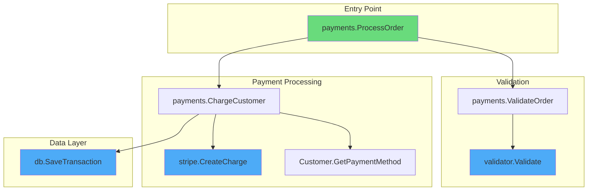
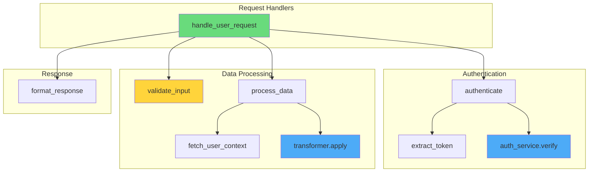
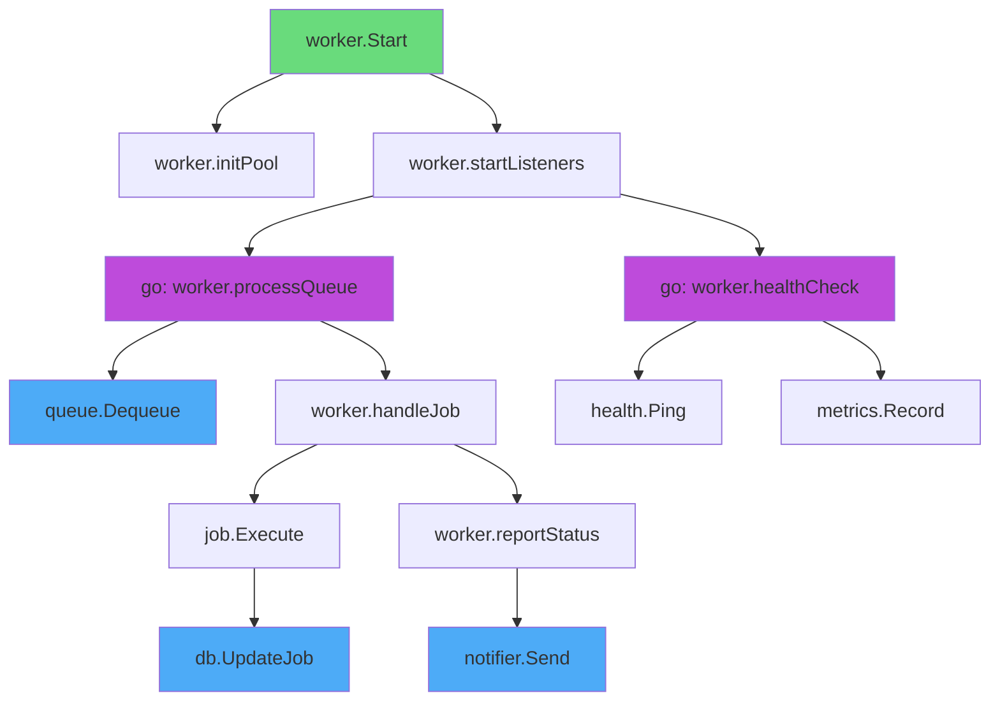

# Call Graph Examples

## Example 1: Go Payment Processing

**Command**: `/flow payments/processor.go --type=call --depth=3`

**Source Code** (simplified):
```go
package payments

func ProcessOrder(order *Order) error {
    if err := ValidateOrder(order); err != nil {
        return err
    }
    return ChargeCustomer(order.Customer, order.Total)
}

func ValidateOrder(order *Order) error {
    return validator.Validate(order)
}

func ChargeCustomer(customer *Customer, amount float64) error {
    card, err := customer.GetPaymentMethod()
    if err != nil {
        return err
    }

    charge, err := stripe.CreateCharge(card, amount)
    if err != nil {
        return err
    }

    return db.SaveTransaction(charge)
}
```

**Output**:



**Analysis**:
- Entry point: `ProcessOrder` handles the main order flow
- External dependencies: `validator`, `stripe`, `db` packages
- Error handling appears present at each step
- Linear flow with no circular dependencies

---

## Example 2: Python API Handler

**Command**: `/flow api/handlers.py --type=call`

**Source Code** (simplified):
```python
async def handle_user_request(request):
    user = await authenticate(request)
    data = validate_input(request.body)
    result = await process_data(user, data)
    return format_response(result)

async def authenticate(request):
    token = extract_token(request.headers)
    return await auth_service.verify(token)

async def process_data(user, data):
    enriched = await fetch_user_context(user)
    return await transformer.apply(enriched, data)
```

**Output**:



**Analysis**:
- Async flow with multiple await points
- `validate_input` (highlighted yellow) has no visible error handling
- External services: `auth_service`, `transformer`
- Consider: What happens if `validate_input` fails?

---

## Example 3: Complex Go Service with Goroutines

**Command**: `/flow service/worker.go --type=call --depth=4`

**Output**:



**Legend**:
- Green: Entry points
- Purple: Goroutines (concurrent execution)
- Blue: External/IO calls

**Analysis**:
- Spawns 2 goroutines for concurrent processing
- `processQueue` runs in a loop, calling external queue
- Potential concern: No visible error recovery in goroutines
- `healthCheck` and `processQueue` run independently

---

## Example 4: Verbose Mode (Onboarding)

**Command**: `/flow payments/processor.go --type=call --verbose`

**Output**:


---

## How to Read This Diagram

### Node Shapes
- **Rectangles** `[name]` represent functions or methods
- **Diamonds** `{condition}` represent decision points (not shown in this call graph)
- **Stadiums** `([loop])` represent loops or iterations

### Arrows
- Arrows (`-->`) show function calls: the source function calls the target function
- Read top-to-bottom to follow the execution flow

### Colors
| Color | Meaning |
|-------|---------|
| 🟢 Green (`#69db7c`) | Entry points - where execution begins |
| 🔵 Blue (`#4dabf7`) | External calls - calls to other packages or services |
| 🟡 Yellow (`#ffd43b`) | Warnings - potential issues or missing error handling |
| 🔴 Red (`#ff6b6b`) | Error paths - error returns or failure branches |
| 🟣 Purple (`#be4bdb`) | Goroutines - concurrent execution (Go specific) |

### Subgraphs
Grouped boxes (subgraphs) show logical layers or related functionality. In this diagram:
- **Entry Point**: Where requests come in
- **Validation**: Input checking before processing
- **Payment Processing**: Core business logic
- **Data Layer**: Database operations

---

## Glossary

| Term | Definition |
|------|------------|
| `ProcessOrder` | Main entry function that orchestrates the order flow |
| `ValidateOrder` | Checks that the order data is valid before processing |
| `ChargeCustomer` | Handles the payment transaction with the customer |
| `validator` | External package for data validation |
| `stripe` | Payment processing service (Stripe API) |
| `db` | Database access layer for persistence |

---

## Architecture Context

This code is part of the **payments service layer**. It sits between:
- **API handlers** (above) - receive HTTP requests and call `ProcessOrder`
- **External services** (below) - Stripe for payments, database for persistence

The pattern used here is **procedural with error propagation**:
- Each function returns an error if something fails
- Errors bubble up to the caller
- The caller decides how to handle the error

---

## Next Steps for Learning

1. **Trace upstream**: Find where `ProcessOrder` is called from (likely an HTTP handler)
2. **Explore error handling**: Search for `if err != nil` patterns to see how errors are handled
3. **Check the models**: Look at `Order` and `Customer` struct definitions
4. **Review external integrations**: Examine `stripe.CreateCharge` to understand the Stripe integration
5. **Database layer**: Explore `db.SaveTransaction` to understand data persistence

**Related files to explore**:
- `handlers/order_handler.go` - HTTP handler that calls this code
- `models/order.go` - Order struct definition
- `integrations/stripe.go` - Stripe client wrapper
