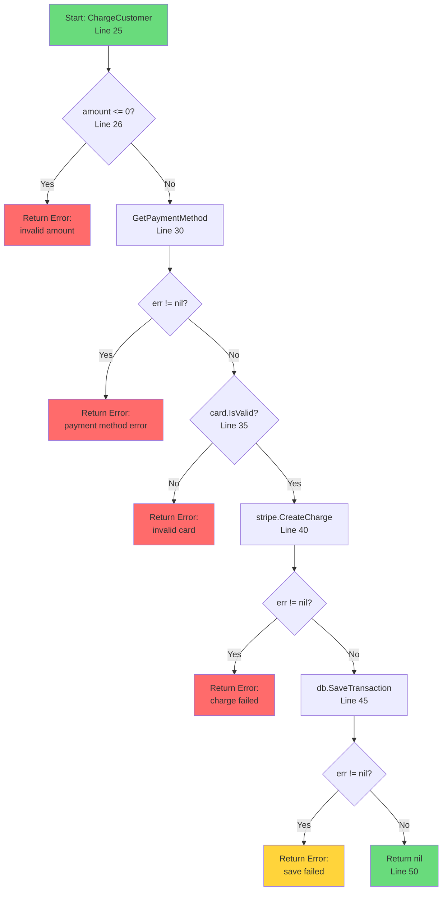
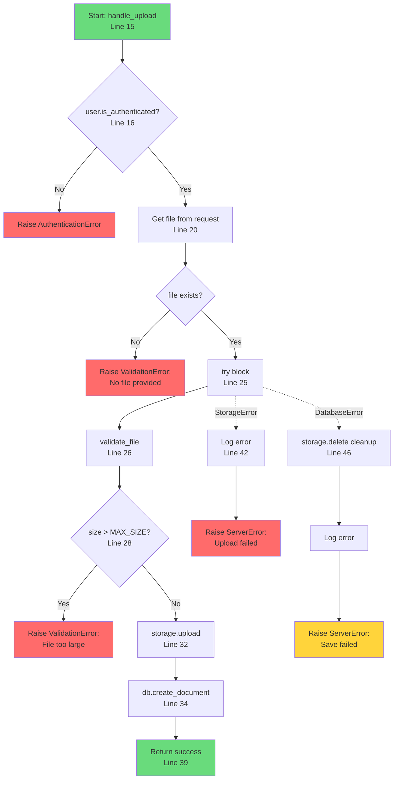
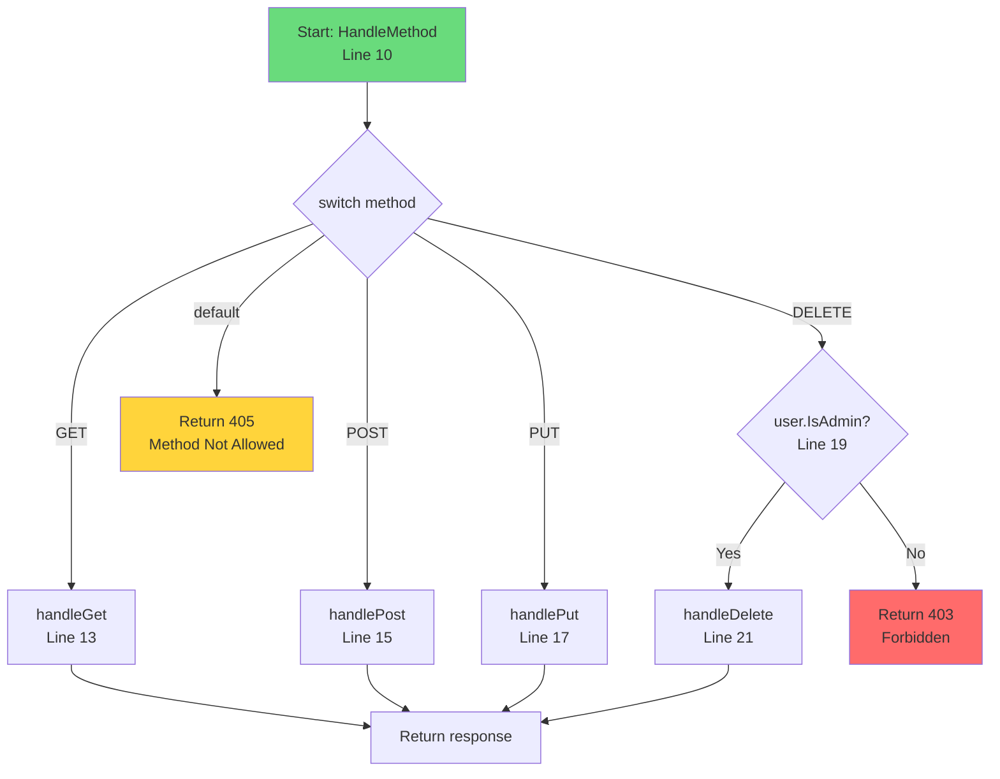

# Control Flow Examples

## Example 1: Go Error Handling Function

**Command**: `/flow payments/processor.go --type=control --function=ChargeCustomer`

**Source Code**:
```go
// Line 25
func ChargeCustomer(customer *Customer, amount float64) error {
    // Line 26
    if amount <= 0 {
        return errors.New("invalid amount")
    }

    // Line 30
    card, err := customer.GetPaymentMethod()
    if err != nil {
        return fmt.Errorf("payment method error: %w", err)
    }

    // Line 35
    if !card.IsValid() {
        return errors.New("invalid card")
    }

    // Line 40
    charge, err := stripe.CreateCharge(card, amount)
    if err != nil {
        return fmt.Errorf("charge failed: %w", err)
    }

    // Line 45
    if err := db.SaveTransaction(charge); err != nil {
        // Note: Charge succeeded but save failed - potential issue!
        return fmt.Errorf("save failed: %w", err)
    }

    // Line 50
    return nil
}
```

**Output**:



**Analysis**:
- **Location**: `payments/processor.go:25-50`
- **Cyclomatic Complexity**: 6 (5 decision points + 1)
- **Branches**: 6 possible exit points (5 errors, 1 success)
- **Issue Found**: Line 45 - If `SaveTransaction` fails, the charge has already succeeded with Stripe. This could lead to:
  - Customer charged but no record
  - Potential need for refund logic
  - Consider: wrap in transaction or add compensation logic

---

## Example 2: Python Async Handler

**Command**: `/flow api/handlers.py --type=control --function=handle_upload`

**Source Code**:
```python
# Line 15
async def handle_upload(request):
    # Line 16
    if not request.user.is_authenticated:
        raise AuthenticationError("Login required")

    # Line 20
    file = request.files.get('document')
    if not file:
        raise ValidationError("No file provided")

    # Line 25
    try:
        # Line 26
        validated = await validate_file(file)

        # Line 28
        if validated.size > MAX_SIZE:
            raise ValidationError("File too large")

        # Line 32
        stored = await storage.upload(validated)

        # Line 34
        record = await db.create_document(
            user=request.user,
            path=stored.path
        )

        # Line 39
        return {"id": record.id, "url": stored.url}

    except StorageError as e:
        # Line 42
        logger.error(f"Storage failed: {e}")
        raise ServerError("Upload failed")

    except DatabaseError as e:
        # Line 46
        await storage.delete(stored.path)  # Cleanup
        logger.error(f"DB failed: {e}")
        raise ServerError("Save failed")
```

**Output**:



**Analysis**:
- **Location**: `api/handlers.py:15-47`
- **Cyclomatic Complexity**: 7
- **Exception Handling**: Good - catches specific exceptions
- **Cleanup Logic**: Present for DatabaseError (deletes uploaded file)
- **Potential Issue**: StorageError handler doesn't need cleanup (upload didn't complete), but verify `validate_file` doesn't create temporary files

---

## Example 3: Go Switch Statement

**Command**: `/flow router/handler.go --type=control --function=HandleMethod`

**Output**:



**Analysis**:
- **Location**: `router/handler.go:10-25`
- **All HTTP methods handled**: GET, POST, PUT, DELETE + default
- **Authorization**: DELETE requires admin rights
- **Note**: Consider if PUT should also require authorization
