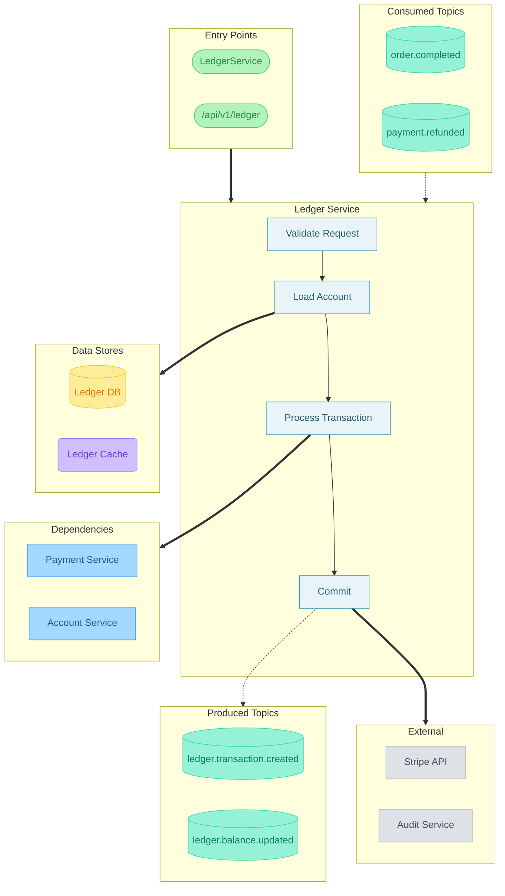

# Service Flow: Ledger Service

> Generated: 2024-01-15T14:35:00Z
> Source: services/ledger/

---

## Diagram



---

## Legend

| Symbol | Meaning |
|--------|---------|
| `==>` | **Synchronous** (gRPC/HTTP) |
| `-.->` | **Asynchronous** (Kafka) |
| `-->` | Internal call / step chain |

### Colors

| Color | Meaning |
|-------|---------|
| Blue | Services |
| Green | Entry Points |
| Teal | Kafka Topics |
| Yellow | Databases |
| Purple | Caches |
| Gray | External Systems |
| Light Blue | Internal Steps |

---

## Sync Dependencies

| From | To | Type | Source |
|------|-----|------|--------|
| Ledger Service | Payment Service | gRPC | internal/client/payment_client.go:45 |
| Ledger Service | Account Service | gRPC | internal/client/account_client.go:32 |

---

## Async Dependencies

| Topic | Direction | Source |
|-------|-----------|--------|
| order.completed | consume | internal/consumer/order_consumer.go:27 |
| payment.refunded | consume | internal/consumer/refund_consumer.go:15 |
| ledger.transaction.created | produce | internal/producer/transaction_producer.go:34 |
| ledger.balance.updated | produce | internal/producer/balance_producer.go:22 |

---

## Data Stores

| Store | Type | Source |
|-------|------|--------|
| Ledger DB | postgresql | internal/repository/ledger_repo.go:12 |
| Ledger Cache | redis | internal/cache/balance_cache.go:15 |

---

## External Systems

| System | Type | Source |
|--------|------|--------|
| Stripe API | https | internal/webhook/stripe_handler.go:56 |
| Audit Service | grpc | internal/audit/client.go:18 |

---

## Source References

All dependencies traced from:

- `internal/client/payment_client.go:45` - Payment Service gRPC client
- `internal/client/account_client.go:32` - Account Service gRPC client
- `internal/consumer/order_consumer.go:27` - Order completed consumer
- `internal/consumer/refund_consumer.go:15` - Payment refunded consumer
- `internal/producer/transaction_producer.go:34` - Transaction created producer
- `internal/producer/balance_producer.go:22` - Balance updated producer
- `internal/repository/ledger_repo.go:12` - Database repository
- `internal/cache/balance_cache.go:15` - Redis cache client
- `internal/webhook/stripe_handler.go:56` - Stripe webhook handler
- `internal/audit/client.go:18` - Audit service client

---

## Render Commands

```bash
# PNG - high resolution (for documentation)
npx -p @mermaid-js/mermaid-cli mmdc -i flow-diagram.md -o flow-diagram.png -b white -w 3840 -s 2

# SVG (for web, scalable)
npx -p @mermaid-js/mermaid-cli mmdc -i flow-diagram.md -o flow-diagram.svg -b white
```
