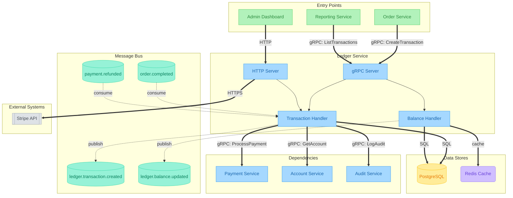

# Service Flow: Ledger Service

> Generated: 2024-01-15T14:35:00Z
> Source: services/ledger/

---

## Diagram



---

## Legend

| Symbol | Meaning | Debug Approach |
|--------|---------|----------------|
| `==>` | **Synchronous** (gRPC/HTTP) - caller blocks | Check latency, timeouts, error codes |
| `-.->` | **Asynchronous** (Kafka) - fire and forget | Check consumer lag, DLQ, offsets |
| `-->` | Internal call | Check logs, traces |

### Node Shapes

| Shape | Meaning |
|-------|---------|
| `[Rectangle]` | Service, Handler |
| `[(Cylinder)]` | Database, Kafka Topic |
| `([Stadium])` | Consumer Group |
| `[[Double Rect]]` | External System |
| `(Rounded)` | Cache |

### Colors

| Color | Meaning |
|-------|---------|
| Blue | Services |
| Green | Entry Points |
| Teal | Kafka Topics |
| Yellow | Databases |
| Purple | Caches |
| Gray | External Systems |

---

## Sync Dependencies

| From | To | Type | Method/Endpoint | Timeout | Retry | Source |
|------|-----|------|-----------------|---------|-------|--------|
| Ledger Service | Payment Service | gRPC | ProcessPayment, RefundPayment | 5s | Yes | internal/client/payment_client.go:45 |
| Ledger Service | Account Service | gRPC | GetAccount, ValidateAccount | 3s | Yes | internal/client/account_client.go:32 |
| Ledger Service | Audit Service | gRPC | LogAudit | - | - | internal/audit/client.go:18 |
| Ledger Service | PostgreSQL | SQL | read/write | - | - | internal/repository/ledger_repo.go:12 |
| Ledger Service | Redis | cache | read/write | - | - | internal/cache/balance_cache.go:15 |
| Ledger Service | Stripe API | HTTPS | webhook verify | - | - | internal/webhook/stripe_handler.go:56 |

---

## Async Dependencies

| Topic | Direction | Consumer Group | DLQ | Source |
|-------|-----------|----------------|-----|--------|
| order.completed | consume | ledger-order-consumer | Yes | internal/consumer/order_consumer.go:27 |
| payment.refunded | consume | ledger-refund-consumer | Yes | internal/consumer/refund_consumer.go:15 |
| ledger.transaction.created | produce | - | - | internal/producer/transaction_producer.go:34 |
| ledger.balance.updated | produce | - | - | internal/producer/balance_producer.go:22 |

---

## External Systems

| System | Type | Purpose | Source |
|--------|------|---------|--------|
| Stripe API | HTTPS | Payment webhook verification | internal/webhook/stripe_handler.go:56 |
| Audit Service | gRPC | Compliance logging | internal/audit/client.go:18 |

---

## Data Stores

| Store | Type | Operations | Source |
|-------|------|------------|--------|
| PostgreSQL | Database | read/write | internal/repository/ledger_repo.go:12 |
| Redis | Cache | Balance cache | internal/cache/balance_cache.go:15 |

---

## Source References

All dependencies traced from:

- `internal/client/payment_client.go:45` - Payment Service gRPC client
- `internal/client/account_client.go:32` - Account Service gRPC client
- `internal/consumer/order_consumer.go:27` - Order completed consumer
- `internal/consumer/refund_consumer.go:15` - Payment refunded consumer
- `internal/producer/transaction_producer.go:34` - Transaction created producer
- `internal/producer/balance_producer.go:22` - Balance updated producer
- `internal/repository/ledger_repo.go:12` - Database repository
- `internal/cache/balance_cache.go:15` - Redis cache client
- `internal/webhook/stripe_handler.go:56` - Stripe webhook handler
- `internal/audit/client.go:18` - Audit service client
- `services/ledger/docs/RUNBOOK.md` - Service runbook

---

## Render Commands

Generate PNG - high resolution (recommended for documentation):
```bash
npx -p @mermaid-js/mermaid-cli mmdc -i diagram.md -o diagram.png -b white -w 3840 -s 2
```

Generate SVG (for web, scalable):
```bash
npx -p @mermaid-js/mermaid-cli mmdc -i diagram.md -o diagram.svg -b white
```

Generate PDF:
```bash
npx -p @mermaid-js/mermaid-cli mmdc -i diagram.md -o diagram.pdf -b white
```
