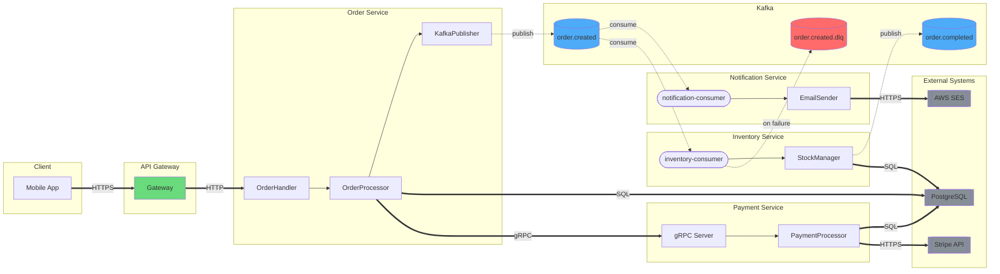
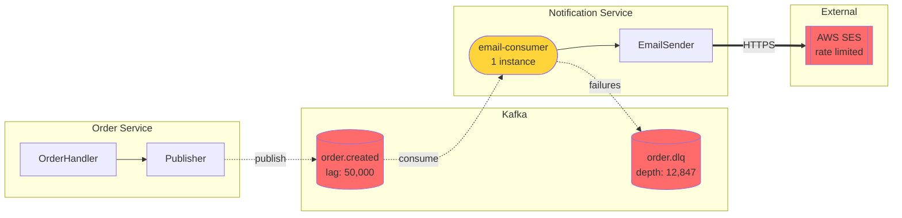
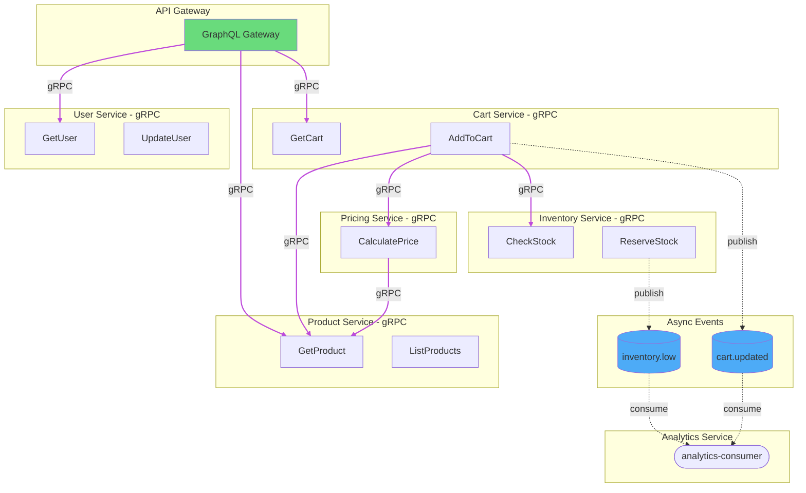
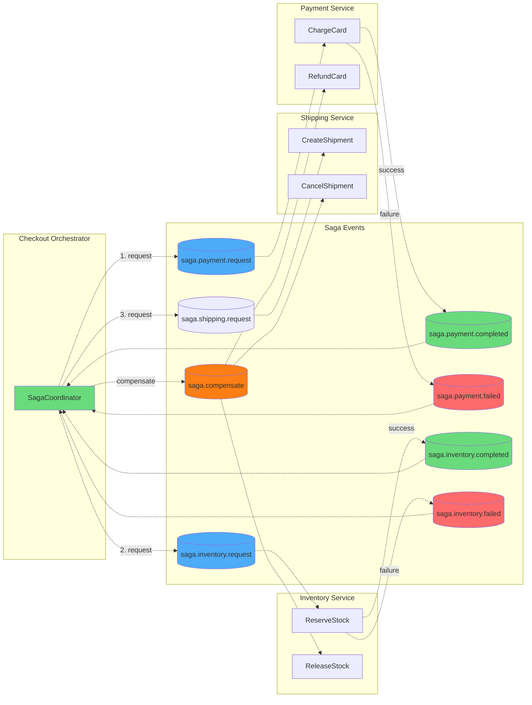
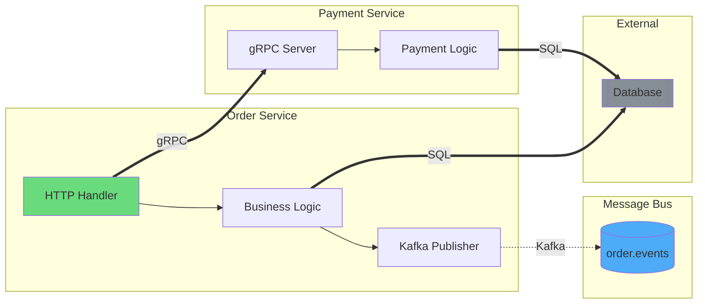

# Service Flow Examples

## Example 1: E-Commerce Order Flow (Mixed Sync/Async)

**Command**: `/flow services/ --type=service`

This example shows a typical order processing flow with both gRPC (sync) and Kafka (async) communication.



**Legend:**

| Arrow | Meaning | Debug Approach |
|-------|---------|----------------|
| `==>` | **Sync** (gRPC/HTTP) - caller blocks | Check latency, timeouts, error codes |
| `-.->` | **Async** (Kafka) - fire & forget | Check consumer lag, DLQ, offsets |
| `-->` | Internal call | Check logs, traces |

**Communication Summary:**

### Sync Calls (gRPC/HTTP)
| From | To | Protocol | Timeout | Notes |
|------|-----|----------|---------|-------|
| Client | Gateway | HTTPS | 30s | Client-facing |
| Gateway | OrderService | HTTP | 10s | Internal |
| OrderService | PaymentService | gRPC | 5s | Critical path |
| PaymentService | Stripe | HTTPS | 30s | External API |
| All Services | PostgreSQL | SQL | 5s | Database |

### Async Messages (Kafka)
| Topic | Producers | Consumers | DLQ |
|-------|-----------|-----------|-----|
| `order.created` | OrderService | InventoryService, NotificationService | Yes |
| `order.completed` | InventoryService | - | No |

**Analysis:**
- Order creation is sync through payment (user waits for payment confirmation)
- Inventory and notification are async (user doesn't wait)
- DLQ configured for inventory failures
- `order.completed` has no consumers - verify if this is intentional

---

## Example 2: Incident Investigation View

**Command**: `/flow services/ --type=service`

**Scenario**: Orders are being placed but customers aren't receiving confirmation emails.



**Legend:**

| Arrow | Meaning | Debug Approach |
|-------|---------|----------------|
| `==>` | **Sync** (gRPC/HTTP) - caller blocks | Check latency, timeouts, error codes |
| `-.->` | **Async** (Kafka) - fire & forget | Check consumer lag, DLQ, offsets |
| `-->` | Internal call | Check logs, traces |

**Issues Identified:**

### Critical ❌
1. **Consumer lag: 50,000 messages** on `order.created`
   - Messages are backing up faster than they're processed
   - Action: Scale consumers or investigate processing bottleneck

2. **DLQ depth: 12,847 messages**
   - Many messages are failing processing
   - Action: Investigate DLQ messages for common error pattern

3. **AWS SES rate limited**
   - External dependency is throttling requests
   - Action: Implement backoff, request limit increase

### Warnings ⚠️
1. **Single consumer instance** for critical topic
   - No redundancy, single point of failure
   - Action: Scale to at least 3 instances

**Incident Investigation Steps:**

1. ✅ Async path issue confirmed (not sync)
2. Check consumer lag: `kafka-consumer-groups --describe --group email-consumer`
3. Check DLQ: Sample messages for error patterns
4. Check SES: CloudWatch metrics for throttling
5. Scale consumers: Increase replicas from 1 to 3
6. Implement exponential backoff for SES calls

---

## Example 3: gRPC-Heavy Microservices

**Command**: `/flow services/ --type=service`

This example shows a system where most communication is sync gRPC.



**Legend:**

| Arrow | Meaning | Debug Approach |
|-------|---------|----------------|
| `==>` | **Sync** (gRPC) - caller blocks | Check latency, timeouts, error codes, circuit breaker |
| `-.->` | **Async** (Kafka) - fire & forget | Check consumer lag, DLQ |

**Sync Call Chain Analysis:**

```
Gateway -> CartService -> ProductService -> (response)
                       -> PricingService -> ProductService -> (response)
                       -> InventoryService -> (response)
```

**Critical Path**: AddToCart requires 4 sync calls to complete
- Total latency = sum of all service latencies
- Single failure = entire request fails

**Recommendations:**
1. Add circuit breakers between services
2. Consider caching ProductService responses
3. Add timeout budgets (if Gateway timeout is 5s, downstream must be <5s total)

---

## Example 4: Saga Pattern with Compensation

**Command**: `/flow services/checkout/ --type=service`



**Legend:**

| Arrow | Meaning | Debug Approach |
|-------|---------|----------------|
| `-.->` | **Async** (Kafka) - all saga steps are async | Check consumer lag, message ordering |
| Orange | Compensation/rollback path | Check if compensations completed |

**Saga Flow:**
1. All steps are **async** (Kafka-based saga)
2. Each step publishes success or failure
3. Coordinator decides next step or compensation
4. Compensation reverses completed steps on failure

**Debugging Saga Issues:**
1. Check saga state in database
2. Verify all step events were published
3. Check for stuck sagas (no progress)
4. Verify compensation messages were processed

---

## Example 5: Verbose Mode (Onboarding)

**Command**: `/flow services/ --type=service --verbose`



---

## How to Read This Diagram

### Understanding Arrow Types (CRITICAL)

The most important thing to understand is the **difference between arrow types**:

#### Thick Solid Arrows (`==>`) = SYNC
```
ServiceA ==>|gRPC| ServiceB
```
- **What happens**: ServiceA calls ServiceB and **WAITS** for a response
- **If it fails**: ServiceA gets an error immediately
- **Timeout**: If ServiceB is slow, ServiceA might timeout
- **Example**: `response, err := paymentClient.Charge(ctx, request)`

#### Dotted Arrows (`-.->`) = ASYNC
```
ServiceA -.->|Kafka| Topic
```
- **What happens**: ServiceA publishes a message and **CONTINUES immediately**
- **If it fails**: ServiceA doesn't know (unless publish itself fails)
- **Processing**: Happens later, by some consumer
- **Example**: `producer.Send("orders", orderEvent)`

#### Thin Solid Arrows (`-->`) = INTERNAL
```
Handler --> Processor
```
- **What happens**: Function call within the same service
- **Same process**: No network involved

### Why This Matters for Debugging

**Scenario**: User complains order confirmation email never arrived

**If the path is SYNC (`==>`)**:
- Error happened immediately
- Check error logs at time of request
- Look for timeout or error response
- User probably saw an error

**If the path is ASYNC (`-.->`)**:
- Error happened later (or message is stuck)
- Check Kafka consumer lag
- Check Dead Letter Queue
- User saw "success" but processing failed later

### Node Shapes

| Shape | Syntax | Meaning |
|-------|--------|---------|
| Rectangle | `[Name]` | Service, handler, or component |
| Cylinder | `[(name)]` | Kafka topic or message queue |
| Stadium | `([name])` | Consumer group |
| Double Rectangle | `[[Name]]` | External system (DB, 3rd party API) |

### Colors

| Color | Meaning |
|-------|---------|
| 🟢 Green | Entry point - where requests come in |
| 🔵 Blue | Kafka topic - async message storage |
| 🔴 Red | Error path - DLQ, failures |
| 🟡 Yellow | Warning - potential issue |
| 🟣 Purple | gRPC calls (optional highlight) |
| ⚫ Gray | External systems |
| 🟠 Orange | Retry/compensation paths |

---

## Glossary

### Sync Communication
| Term | Definition |
|------|------------|
| **gRPC** | High-performance RPC framework using HTTP/2 and Protocol Buffers |
| **Timeout** | Maximum time to wait for sync response before failing |
| **Circuit Breaker** | Pattern to stop calling failing services temporarily |
| **Deadline** | gRPC concept - absolute time by which call must complete |

### Async Communication
| Term | Definition |
|------|------------|
| **Topic** | Named channel in Kafka where messages are stored |
| **Partition** | Subdivision of topic for parallelism |
| **Consumer Group** | Set of consumers sharing work on a topic |
| **Offset** | Position in topic - where consumer has read up to |
| **Lag** | How far behind a consumer is (unprocessed messages) |
| **DLQ** | Dead Letter Queue - where failed messages go |

### General
| Term | Definition |
|------|------------|
| **Saga** | Pattern for distributed transactions using async events |
| **Idempotency** | Processing same message twice has same effect as once |
| **At-least-once** | Messages delivered at least once (may duplicate) |
| **Exactly-once** | Messages delivered exactly once (hard to achieve) |

---

## Incident Investigation Guide

### Sync Path Issues (gRPC/HTTP)

**Symptoms**: Immediate errors, timeouts, high latency

**What to check**:
1. **Error rates**: Dashboard showing 5xx or gRPC errors
2. **Latency**: P99 latency spikes
3. **Circuit breaker**: Is it open? Check circuit breaker dashboard
4. **Downstream health**: Is the called service healthy?
5. **Logs**: Error messages at time of failure

**Common causes**:
- Downstream service down
- Network issues
- Resource exhaustion (CPU, memory, connections)
- Timeout too aggressive

### Async Path Issues (Kafka)

**Symptoms**: Delayed processing, missing data, growing lag

**What to check**:
1. **Consumer lag**: `kafka-consumer-groups --describe --group <group>`
2. **DLQ depth**: How many messages in dead letter queue?
3. **Consumer health**: Are consumer pods running?
4. **Partition assignment**: Are all partitions assigned?
5. **Message inspection**: Sample DLQ messages for patterns

**Common causes**:
- Consumer crashed or stuck
- Processing too slow (scale consumers)
- Poison message blocking partition
- Schema mismatch
- External dependency in consumer failing

---

## Architecture Context

This diagram shows a **microservices architecture** with:

### Communication Patterns
- **Sync (gRPC)**: Used for operations where caller needs immediate response
- **Async (Kafka)**: Used for decoupling, event-driven flows, eventual consistency

### When to Use Sync
- User is waiting for response
- Need immediate confirmation
- Transaction must be atomic

### When to Use Async
- User doesn't need to wait
- Decoupling between services
- High throughput requirements
- Event sourcing / audit trails

---

## Next Steps for Learning

1. **Trace a request**: Follow a single order from API to completion
2. **Find gRPC definitions**: Look in `proto/` directory for `.proto` files
3. **Find Kafka topics**: Search for `topic` in config files
4. **Check consumer groups**: `kafka-consumer-groups --list`
5. **Review error handling**: Search for timeout and retry configuration
6. **Understand circuit breakers**: Look for hystrix, resilience4j, or similar

**Key files to explore**:
- `proto/*.proto` - gRPC service definitions
- `config/kafka.yaml` - Kafka topic configuration
- `internal/client/*.go` - gRPC client wrappers
- `internal/consumer/*.go` - Kafka consumers
