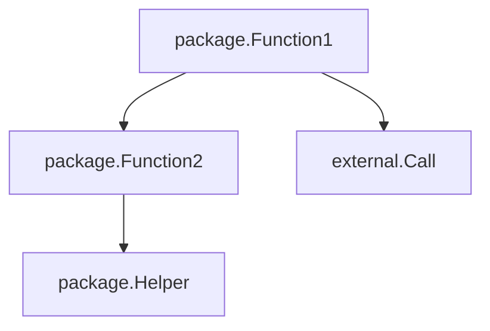
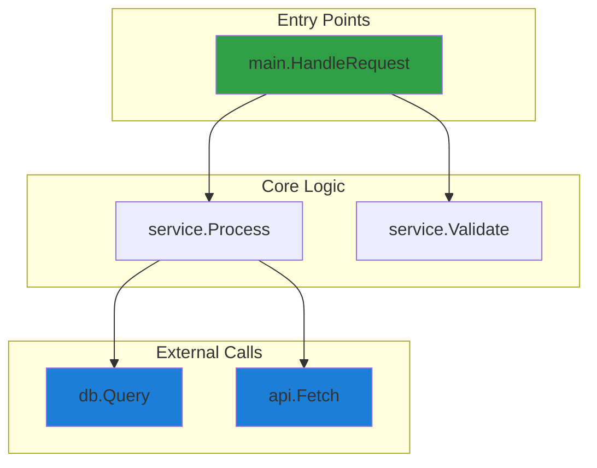

# Call Graph Generation Prompt

## Overview

Generate a call graph showing function dependencies and call relationships in the codebase.

## Steps

### 1. Analyze the Source Code

Read the target file(s) and identify:
- All function/method definitions
- Function calls within each function
- External package/module calls
- Method receivers (Go) or class methods (Python)

### 2. Build the Call Graph

For each function, trace:
- Direct function calls
- Method invocations
- Callbacks and closures (where identifiable)
- Goroutine spawns (Go) or async calls (Python)

Limit tracing to the specified depth (default: 3 levels).

### 3. Language-Specific Parsing

#### Go
- Parse `func` declarations including receivers: `func (r *Receiver) Method()`
- Track interface method calls
- Identify goroutine spawns with `go func()`
- Note `defer` statements that may affect flow
- Track channel operations where relevant

#### Python
- Parse `def` and `async def` declarations
- Handle class methods with `self` parameter
- Track decorator usage that wraps functions
- Identify `with` statements and context managers
- Note generator functions (`yield`)

### 4. Generate Mermaid Output

Use `flowchart TD` (top-down) layout:

#### Node Naming Convention
- Use `package.FunctionName` format
- For methods: `Type.MethodName`
- Keep names concise but identifiable

#### Styling
- Highlight entry points with distinct color
- Mark error-prone paths in red: `style NODE fill:#e03131`
- Mark external calls in blue: `style NODE fill:#1c7ed6`
- Group related functions with subgraphs when helpful

### 5. Identify Suspicious Patterns

Flag and highlight:
- Functions with no error handling but calling error-prone operations
- Deep call chains (potential stack issues)
- Circular dependencies
- Unchecked external calls
- Missing nil/None checks before method calls

### 6. Output Format

After the diagram, include:
- Summary of the call structure
- Notable patterns observed
- Potential issues or areas to investigate

## Color Reference

| Color | Hex | Use For |
|-------|-----|---------|
| Green | `#2f9e44` | Entry points |
| Blue | `#1c7ed6` | External calls (DB, API, packages) |
| Red | `#e03131` | Error-prone paths, missing error handling |
| Yellow | `#f08c00` | Warnings, suspicious patterns |
| Purple | `#9c36b5` | Goroutines, async operations |

## Output Reliability Checklist

Before finalizing output, verify:
- [ ] All functions are named with `package.FunctionName` format
- [ ] Entry points are highlighted in green
- [ ] External calls are highlighted in blue
- [ ] Suspicious patterns are flagged with yellow or red
- [ ] Subgraphs are used to group related functions
- [ ] Analysis notes explain key observations
