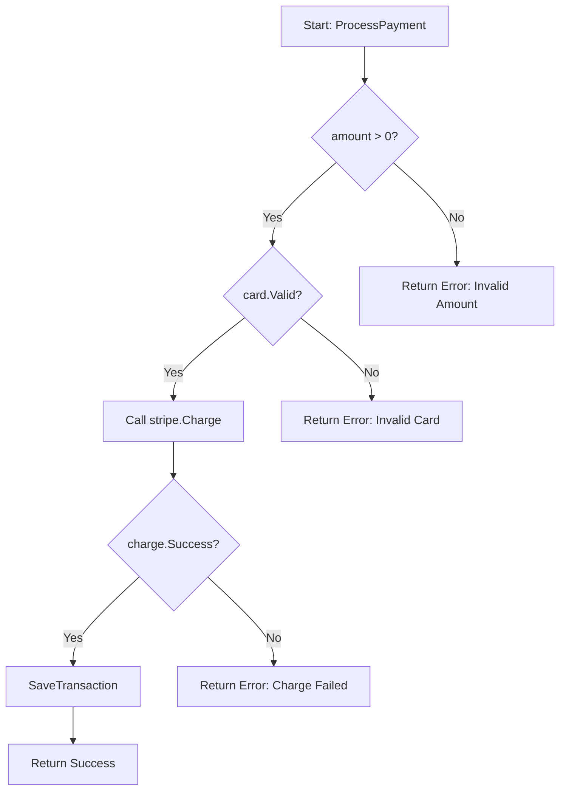
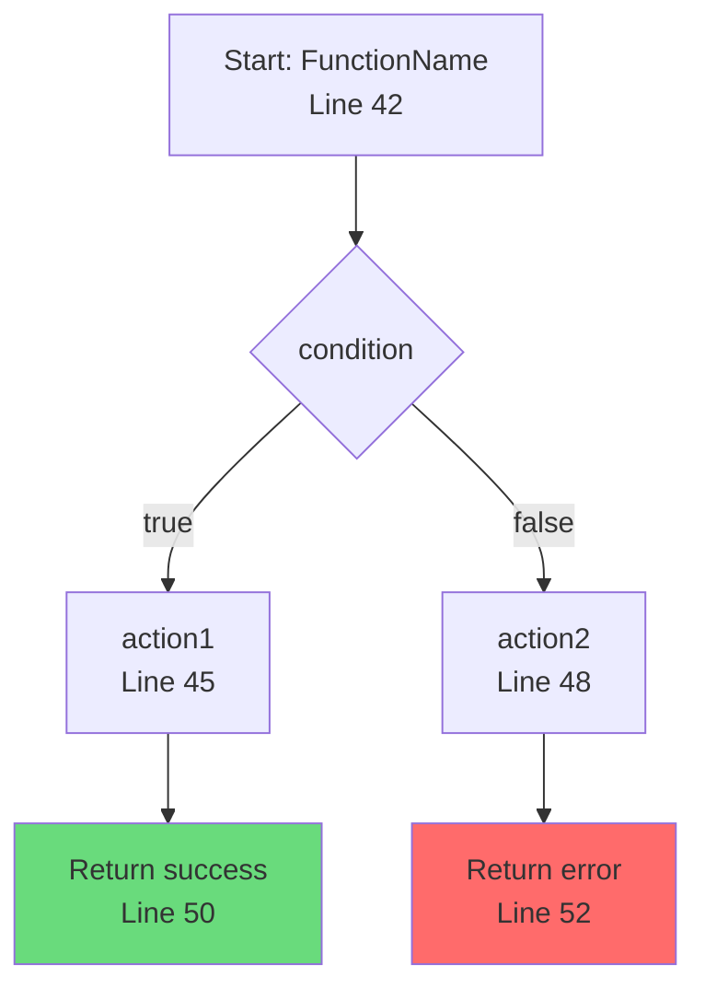

# Control Flow Generation Prompt

## Overview

Generate a control flow graph for a specific function, showing all execution paths and branching logic.

## Steps

### 1. Locate the Function

Find the specified function in the source code:
- Match by function name
- For methods, match `Type.Method` or just `Method`
- Report line numbers for reference

### 2. Parse Control Structures

Identify all control flow elements:

#### Conditional Branches
- `if`/`else if`/`else` chains
- `switch`/`case` statements (Go)
- `match` statements (Python 3.10+)
- Ternary expressions

#### Loops
- `for` loops (all variants)
- `while` loops (Python)
- `range` iterations
- Loop control: `break`, `continue`

#### Error Handling
- `try`/`except`/`finally` (Python)
- Error returns and checks (Go)
- `panic`/`recover` (Go)

#### Early Returns
- Guard clauses
- Error returns
- Success returns

#### Special Constructs
- `defer` statements (Go)
- `with` context managers (Python)
- Goroutines and channels (Go)
- `async`/`await` (Python)

### 3. Build the Flow Graph

Map each control structure to graph nodes:

| Code Construct | Node Type | Mermaid Syntax |
|---------------|-----------|----------------|
| Function start | Rectangle | `A[Start: FuncName]` |
| Regular statement | Rectangle | `B[statement]` |
| Condition | Diamond | `C{condition?}` |
| Loop | Stadium | `D([loop])` |
| Return | Rectangle | `E[Return value]` |
| Error | Rectangle | `F[Error: message]` |

### 4. Language-Specific Handling

#### Go
```go
// Error checking pattern
if err != nil {
    return err
}
```
Map to:
```
A{err != nil?} -->|Yes| B[Return err]
A -->|No| C[Continue]
```

#### Python
```python
# Try/except pattern
try:
    result = risky_operation()
except ValueError as e:
    handle_error(e)
```
Map to:
```
A[try: risky_operation] --> B{exception?}
B -->|ValueError| C[handle_error]
B -->|No exception| D[Continue]
```

### 5. Generate Mermaid Output



### 6. Annotate with Line Numbers

Add line number references in node labels or as notes:
- `A[L45: Validate input]`
- Or use Mermaid notes for complex annotations

### 7. Highlight Issues

Use styling to mark:
- **Error paths** (red): `style NODE fill:#ff6b6b`
- **Happy path** (green): `style NODE fill:#69db7c`
- **Suspicious branches** (yellow): `style NODE fill:#ffd43b`

Flag:
- Missing error handling
- Unreachable code paths
- Complex nested conditions
- Missing default cases in switches

### 8. Output Format



After the diagram, include:
- Function location (file:line)
- Complexity assessment (cyclomatic complexity estimate)
- Branch coverage notes (all paths identified)
- Potential issues found

## Color Reference

| Color | Hex | Use For |
|-------|-----|---------|
| Green | `#69db7c` | Entry point, success returns, happy path |
| Red | `#ff6b6b` | Error returns, exception paths |
| Yellow | `#ffd43b` | Warnings: missing error handling, suspicious logic |
| Blue | `#4dabf7` | External calls within the function |

## Node Shape Reference

| Shape | Syntax | Use For |
|-------|--------|---------|
| Rectangle | `[text]` | Statements, function start, returns |
| Diamond | `{text}` | Conditions, decisions |
| Stadium | `([text])` | Loops |

## Output Reliability Checklist

Before finalizing output, verify:
- [ ] Function start node is present and labeled
- [ ] All branches have both paths shown (true/false, yes/no)
- [ ] All return statements are terminal nodes
- [ ] Line numbers are included for key nodes
- [ ] Error paths are highlighted in red
- [ ] Happy path is highlighted in green
- [ ] Missing error handling is flagged in yellow
- [ ] Cyclomatic complexity is estimated
