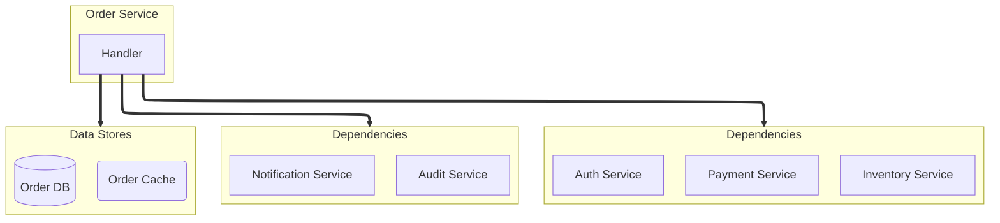
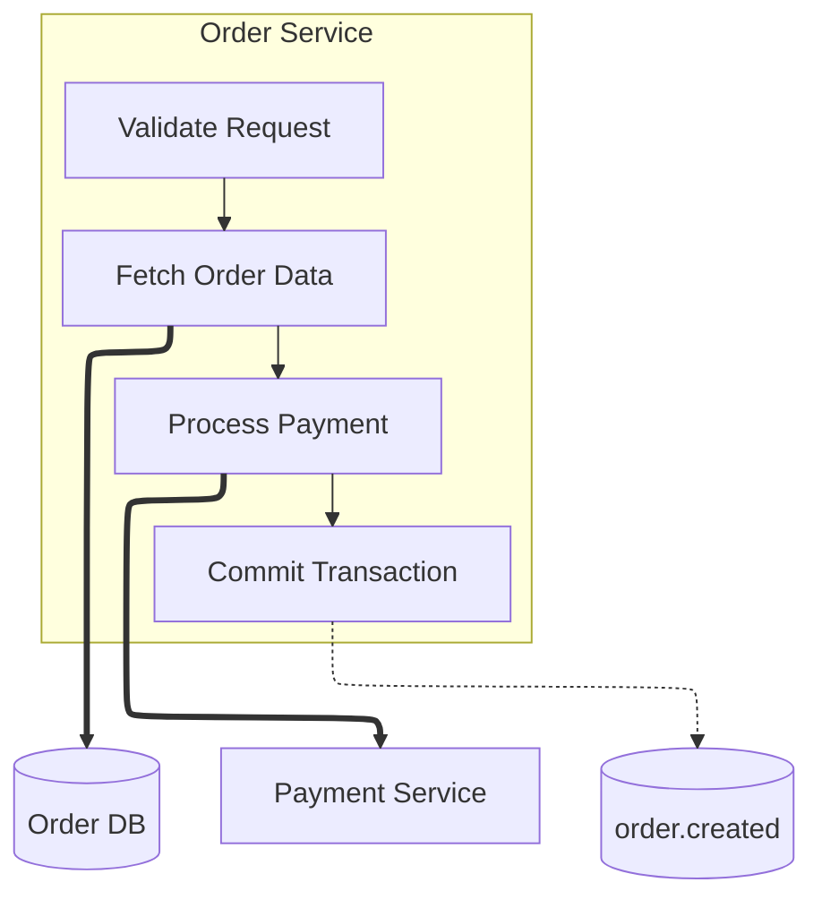

# Phase 2: Diagram Generation

## Objective

Generate a professional Mermaid diagram from `.flow-deps.yaml`.

**CRITICAL: In this phase, you read ONLY the .flow-deps.yaml file. Do NOT read the codebase.**

## Input

- `.flow-deps.yaml` from Phase 1 (in working directory, `services[]` format)

## Output

- `{output}.md` - Mermaid diagram with metadata (default: `flow-diagram.md`)

---

## Process

### Step 1: Read Dependencies File

Read `.flow-deps.yaml` and parse:
- All services in the `services[]` array
- Each service's sync/async dependencies, databases, caches, external systems
- Internal steps (if present)

### Step 2: Plan the Diagram Layout

**Flow direction: Always `flowchart TD` (top-down).**

For **single-service** diagrams:
```
                    TOP
                     ↓
            [Entry Points]
                     ↓
             [Target Service]
                     ↓
          [Dependent Services]
                     ↓
    [Message Bus]     [Data Stores]
                     ↓
            [External Systems]
                     ↓
                   BOTTOM
```

For **multi-service** diagrams:
- Each service becomes its own subgraph
- Use node ID prefixes (`S1_`, `S2_`, `S3_`) to avoid collisions
- Inter-service edges: if Service A depends on "Payment Service" and there's a Service B named "Payment Service", draw an edge between them
- Shared infrastructure (Kafka topics used by multiple services, shared DBs) → shared subgraph outside any service
- Maximum 3 services per diagram — suggest splitting if more

For **pipeline/journey** diagrams:
- Start at TOP, end at BOTTOM
- Add explicit markers: `START([Start: Request Received])` and `END([End: Response Sent])`
- Use dedicated classDef: `classDef startEnd fill:#d4edda,stroke:#28a745,color:#155724,stroke-width:2px`
- Verify visual reading order matches logical flow: top → bottom
- Never place entry point below its downstream dependencies

### Step 3: Generate Mermaid Code

Follow the style guide in `styles/diagram-styles.yaml` EXACTLY.

#### Style Definitions (REQUIRED)

```
classDef service fill:#a5d8ff,stroke:#339af0,color:#1864ab
classDef entry fill:#b2f2bb,stroke:#51cf66,color:#2b8a3e
classDef kafka fill:#96f2d7,stroke:#38d9a9,color:#087f5b
classDef database fill:#ffec99,stroke:#fcc419,color:#e67700
classDef cache fill:#d0bfff,stroke:#9775fa,color:#6741d9
classDef external fill:#dee2e6,stroke:#adb5bd,color:#495057
classDef step fill:#e8f4f8,stroke:#4a9ebb,color:#2c5f7c
classDef startEnd fill:#d4edda,stroke:#28a745,color:#155724,stroke-width:2px
```

### Step 4: Node Naming Rules

| Type | Format | Example |
|------|--------|---------|
| Service | Title Case | `Payment Service` |
| Kafka Topic | lowercase.dot | `order.created` |
| Database | Title Case | `Ledger DB` |
| Cache | Title Case | `Ledger Cache` |
| External | Title Case | `Stripe API` |
| Internal Step | Title Case | `Validate Request` |

**CRITICAL LABEL RULES:**
- **NO NEWLINES** — all labels must be single-line
- **NO ABBREVIATIONS** — use full names always

```
❌ WRONG:
    A[Commit Stage
    (Write)]

✅ CORRECT:
    A[Commit Stage Write]
```

### Step 5: Arrow Rules

| Connection Type | Arrow | Label |
|-----------------|-------|-------|
| gRPC call | `==>` | `\|MethodName\|` (only if useful) |
| HTTP call | `==>` | (no label) |
| Database | `==>` | (no label — the node shape says it all) |
| Cache | `==>` | (no label) |
| Kafka produce | `-.->` | (no label — dotted arrow + cylinder = obvious) |
| Kafka consume | `-.->` | (no label) |
| Internal call | `-->` | (no label) |
| Internal step chain | `-->` | (no label) |

**Labels are for information the diagram doesn't already show.** The arrow style (`==>` vs `-.->`) shows sync vs async. The node shape (cylinder, rounded) shows the target type. Don't repeat what's already visible.

Only add a label when it provides specific context:
- `\|ProcessPayment\|` — tells you which RPC method (useful)
- `\|SQL\|` on an arrow to a database cylinder — redundant, skip it

### Step 6: Subgraph Rules

1. **Always quote titles**: `subgraph id ["Display Name"]`
2. **Use lowercase IDs**: `subgraph kafka-in ["Consumed Topics"]`
3. **Max 4 nodes per subgroup** — if more, split into multiple subgroups stacked vertically
4. **Arrows go to subgroups, NOT individual nodes** — one arrow to a subgroup covers all nodes inside

### Step 6.5: Grouping Rules — Group by Service Context, NOT by Type

**⛔ DO NOT group all topics together, all databases together, etc.**

Group by what's relevant to the same service and the same direction:

| Group | Contains | Example Title |
|-------|----------|---------------|
| Service's consumed topics | Kafka topics this service consumes | `"Consumed Topics"` |
| Service's produced topics | Kafka topics this service produces | `"Produced Topics"` |
| Service's sync dependencies | gRPC/HTTP services it calls | `"Dependencies"` |
| Service's data stores | Its database + cache | `"Data Stores"` |
| Service's external systems | Third-party APIs it calls | `"External"` |

```
❌ WRONG — grouping all topics from all services:
    subgraph topics ["All Kafka Topics"]
        K1[(order.created)]    %% produced by Order Service
        K2[(payment.done)]     %% consumed by Order Service
        K3[(ledger.updated)]   %% produced by Ledger Service
    end

✅ RIGHT — grouping by service + direction:
    subgraph order-out ["Order Service: Produced"]
        K1[(order.created)]
    end
    subgraph order-in ["Order Service: Consumed"]
        K2[(payment.done)]
    end
```

### Step 6.6: Subgroup Sizing and Stacking

**Max 4 nodes per subgroup.** If a service has 7 sync dependencies, split into two subgroups stacked vertically:



**Key rules:**
- Subgroups stack vertically (default `TD` flow)
- **One arrow per subgroup** — NOT one arrow per node inside
- Nodes inside a subgroup that receives an arrow are NOT orphans

---

## ELK Layout Engine

**Always use ELK** for better automatic layout. Add this directive as the first line of every diagram:

```
%%{init: {"flowchart": {"defaultRenderer": "elk"}} }%%
```

ELK (Eclipse Layout Kernel) produces cleaner layouts with less edge crossing than the default dagre renderer. It handles subgraphs and complex connections much better.

---

## Internal Steps Rendering

When a service has `internal_steps`, show them as connected nodes inside its subgraph.

### When to Include Internal Steps

- **Include** when: single-service diagram, OR user asks for "detailed" diagram
- **Skip** for multi-service diagrams unless explicitly requested — keeps things clean

### How to Render

Steps are chained with `-->` arrows in order inside the service subgraph:



**Rules:**
- Steps use `classDef step` styling
- External dependency arrows connect FROM the relevant step (not the service box)
- When no `internal_steps`, service remains a single node (default behavior)

---

## Multi-Service Layout

### Node ID Prefixes

Each service gets a prefix to avoid ID collisions:
- Service 1: `S1_handler`, `S1_db`, `S1_step1`
- Service 2: `S2_handler`, `S2_db`, `S2_step1`

### Inter-Service Edges

If Service A has a sync dependency named "Payment Service" and Service B is named "Payment Service", draw:
```
S1_handler ==> S2_handler
```

### Shared Infrastructure

Only group infrastructure as "shared" if the SAME topic/DB is used by multiple services. Otherwise keep it in the service's own subgroup.

---

## Step 7: Write Complete Markdown File

Use the template from `templates/diagram-template.md`:

```markdown
# Service Flow: {service_name}

Generated: {timestamp}
Source: {target_path}

## Diagram

\`\`\`mermaid
{mermaid_code}
\`\`\`

## Legend

| Symbol | Meaning |
|--------|---------|
| `==>` | **Synchronous** (gRPC/HTTP) |
| `-.->` | **Asynchronous** (Kafka) |
| `-->` | Internal call / step chain |

### Colors

| Color | Meaning |
|-------|---------|
| Blue | Services |
| Green | Entry Points |
| Teal | Kafka Topics |
| Yellow | Databases |
| Purple | Caches |
| Gray | External Systems |
| Light Blue | Internal Steps |

## Dependencies

{dependency_tables}

## Source References

{source_references}
```

---

## Quality Checklist

Before completing Phase 2, verify:

- [ ] ELK renderer directive is first line: `%%{init: {"flowchart": {"defaultRenderer": "elk"}} }%%`
- [ ] All services from .flow-deps.yaml are in the diagram
- [ ] All Kafka topics, databases, caches, external systems are in the diagram
- [ ] Sync calls use `==>`, async use `-.->`, internal use `-->`
- [ ] All subgraph titles are quoted
- [ ] Max 4 nodes per subgroup — split and stack vertically if more
- [ ] Arrows go to subgroups, not individual nodes inside them
- [ ] Grouped by service context (consumed topics, produced topics, deps), NOT by type
- [ ] No redundant labels on arrows
- [ ] classDef styles applied to all nodes
- [ ] Internal steps rendered correctly (if present)

## Output

```
Phase 2 Complete: Diagram Generation

Output: {output}.md

Diagram contains:
- Services: {count}
- Kafka topics: {count}
- Databases: {count}
- External systems: {count}
- Internal steps: {count}

Proceeding to Phase 3: Validation
```
