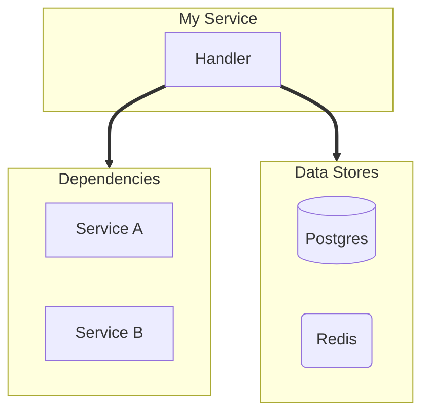
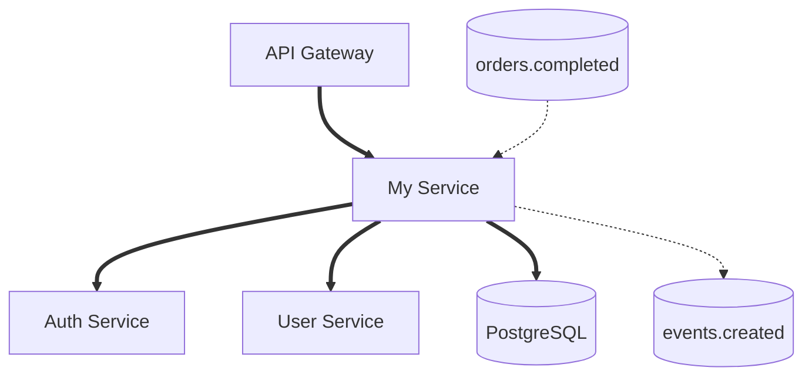

# Phase 2: Diagram Generation

## Objective

Generate a professional Mermaid diagram from `.flow-deps.yaml`.

**CRITICAL: In this phase, you read ONLY the .flow-deps.yaml file. Do NOT read the codebase.**

## Input

- `.flow-deps.yaml` from Phase 1 (in working directory, `services[]` format)

## Output

- `{output}.md` - Mermaid diagram with metadata (default: `flow-diagram.md`)

---

## Process

### Step 1: Read Dependencies File

Read `.flow-deps.yaml` and parse:
- All services in the `services[]` array
- Each service's sync/async dependencies, databases, caches, external systems
- Internal steps (if present)

### Step 2: Plan the Diagram Layout

**Flow direction: Always `flowchart TD` (top-down).**

For **single-service** diagrams:
```
                    TOP
                     ↓
            [Entry Points]
                     ↓
             [Target Service]
                     ↓
          [Dependent Services]
                     ↓
    [Message Bus]     [Data Stores]
                     ↓
            [External Systems]
                     ↓
                   BOTTOM
```

For **multi-service** diagrams:
- Each service becomes its own subgraph
- Use node ID prefixes (`S1_`, `S2_`, `S3_`) to avoid collisions
- Inter-service edges: if Service A depends on "Payment Service" and there's a Service B named "Payment Service", draw an edge between them
- Shared infrastructure (Kafka topics used by multiple services, shared DBs) → shared subgraph outside any service
- Maximum 3 services per diagram — suggest splitting if more

For **pipeline/journey** diagrams:
- Start at TOP, end at BOTTOM
- Add explicit markers: `START([Start: Request Received])` and `END([End: Response Sent])`
- Use dedicated classDef: `classDef startEnd fill:#d4edda,stroke:#28a745,color:#155724,stroke-width:2px`
- Verify visual reading order matches logical flow: top → bottom
- Never place entry point below its downstream dependencies

### Step 3: Generate Mermaid Code

Follow the style guide in `styles/diagram-styles.yaml` EXACTLY.

#### Style Definitions (REQUIRED)

```
classDef service fill:#a5d8ff,stroke:#339af0,color:#1864ab
classDef entry fill:#b2f2bb,stroke:#51cf66,color:#2b8a3e
classDef kafka fill:#96f2d7,stroke:#38d9a9,color:#087f5b
classDef database fill:#ffec99,stroke:#fcc419,color:#e67700
classDef cache fill:#d0bfff,stroke:#9775fa,color:#6741d9
classDef external fill:#dee2e6,stroke:#adb5bd,color:#495057
classDef step fill:#e8f4f8,stroke:#4a9ebb,color:#2c5f7c
classDef startEnd fill:#d4edda,stroke:#28a745,color:#155724,stroke-width:2px
```

### Step 4: Node Naming Rules

| Type | Format | Example |
|------|--------|---------|
| Service | Title Case | `Payment Service` |
| Kafka Topic | lowercase.dot | `order.created` |
| Database | Title Case | `PostgreSQL` |
| Cache | Title Case | `Redis Cache` |
| External | Title Case | `Stripe API` |
| Internal Step | Title Case | `Validate Request` |

**CRITICAL LABEL RULES:**
- **NO NEWLINES** — all labels must be single-line
- **NO ABBREVIATIONS** — use full names always

```
❌ WRONG:
    A[Commit Stage
    (Write)]

✅ CORRECT:
    A[Commit Stage Write]
```

### Step 5: Arrow Rules

| Connection Type | Arrow | Label Format |
|-----------------|-------|--------------|
| gRPC call | `==>` | `\|gRPC: MethodName\|` |
| HTTP call | `==>` | `\|HTTP\|` or `\|REST\|` |
| SQL query | `==>` | `\|SQL\|` |
| Cache read/write | `==>` | `\|cache\|` |
| Kafka produce | `-.->` | `\|publish\|` |
| Kafka consume | `-.->` | `\|consume\|` |
| Internal call | `-->` | (no label or `\|internal\|`) |
| Internal step chain | `-->` | (no label) |

### Step 6: Subgraph Rules

1. **Always quote titles**: `subgraph id ["Display Name"]`
2. **Use lowercase IDs**: `subgraph kafka ["Message Bus"]`
3. **Group by type**: All Kafka topics together, all databases together
4. **Single service per subgraph** for clarity

---

## Internal Steps Rendering

When a service has `internal_steps`, show them as connected nodes inside its subgraph.

### When to Include Internal Steps

- **Include** when: single-service diagram, OR user asks for "detailed" diagram
- **Skip** for multi-service diagrams unless explicitly requested — keeps things clean

### How to Render

Steps are chained with `-->` arrows in order inside the service subgraph:

```mermaid
subgraph S1 ["Order Service"]
    direction TB
    S1_step1[Validate Request] --> S1_step2[Fetch Order Data]
    S1_step2 --> S1_step3[Process Payment]
    S1_step3 --> S1_step4[Commit Transaction]
end

%% External dependency arrows connect FROM the relevant step
S1_step2 ==> DB1[(PostgreSQL)]
S1_step3 ==> S2[Payment Service]
S1_step4 -.-> K1[(order.created)]
```

**Rules:**
- Steps use `classDef step` styling
- External dependency arrows connect FROM the relevant step (not the service box)
- When no `internal_steps`, service remains a single node (default behavior)

---

## Multi-Service Layout

### Node ID Prefixes

Each service gets a prefix to avoid ID collisions:
- Service 1: `S1_handler`, `S1_db`, `S1_step1`
- Service 2: `S2_handler`, `S2_db`, `S2_step1`

### Inter-Service Edges

If Service A has a sync dependency named "Payment Service" and Service B is named "Payment Service", draw:
```
S1_handler ==>|gRPC| S2_handler
```

### Shared Infrastructure

Kafka topics or databases used by multiple services go in a shared subgraph:
```mermaid
subgraph shared ["Shared Infrastructure"]
    direction LR
    K1[(order.created)]
    DB1[(PostgreSQL)]
end
```

---

## Layout Strategy

### Option A: Grouped Layout (Default — moderate complexity)

Use when: 3-8 dependencies, clear groupings



### Option B: Linear Pipeline (Fallback — high complexity)

**USE THIS when the diagram looks messy or has 8+ dependencies.**

Signs you need linear layout:
- Arrows would cross each other
- Too many nodes to fit horizontally
- The grouped layout looks like spaghetti



### Decision Guide

| Dependencies | Kafka Topics | Layout |
|--------------|--------------|--------|
| 1-4 | 0-2 | Grouped (Option A) |
| 5-8 | 2-4 | Grouped with `direction LR` |
| 8+ | 4+ | **Linear Pipeline (Option B)** |
| Any | Crossing arrows | **Linear Pipeline (Option B)** |

**When in doubt, use Linear Pipeline. Clarity > aesthetics.**

---

## Step 7: Write Complete Markdown File

Use the template from `templates/diagram-template.md`:

```markdown
# Service Flow: {service_name}

Generated: {timestamp}
Source: {target_path}

## Diagram

\`\`\`mermaid
{mermaid_code}
\`\`\`

## Legend

| Symbol | Meaning |
|--------|---------|
| `==>` | **Synchronous** (gRPC/HTTP) |
| `-.->` | **Asynchronous** (Kafka) |
| `-->` | Internal call / step chain |

### Colors

| Color | Meaning |
|-------|---------|
| Blue | Services |
| Green | Entry Points |
| Teal | Kafka Topics |
| Yellow | Databases |
| Purple | Caches |
| Gray | External Systems |
| Light Blue | Internal Steps |

## Dependencies

{dependency_tables}

## Source References

{source_references}
```

---

## Quality Checklist

Before completing Phase 2, verify:

- [ ] All services from .flow-deps.yaml are in the diagram
- [ ] All Kafka topics are in the diagram
- [ ] All databases and caches are in the diagram
- [ ] All external systems are in the diagram
- [ ] Sync calls use `==>` arrows
- [ ] Async calls use `-.->` arrows
- [ ] All subgraph titles are quoted
- [ ] classDef styles applied to all nodes
- [ ] No abbreviations in node names
- [ ] Internal steps rendered correctly (if present)
- [ ] Multi-service node IDs use prefixes (if multiple services)

## Output

```
Phase 2 Complete: Diagram Generation

Output: {output}.md

Diagram contains:
- Services: {count}
- Kafka topics: {count}
- Databases: {count}
- External systems: {count}
- Internal steps: {count}

Proceeding to Phase 3: Validation
```
