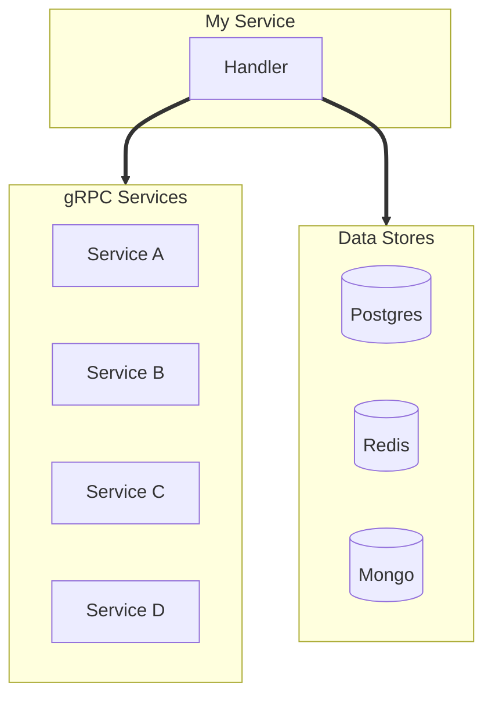

# Phase 2: Diagram Generation

## Objective

Generate a professional Mermaid diagram from `dependencies.yaml`.

**CRITICAL: In this phase, you read ONLY the dependencies.yaml file. Do NOT read the codebase.**

## Input

- `.flow-deps.yaml` from Phase 1 (in working directory)

## Output

- `{output}.md` - Mermaid diagram with metadata (default: `flow-diagram.md`)

## Process

### Step 1: Read Dependencies File

Read `{output_dir}/dependencies.yaml` and parse:
- Service metadata
- All sync dependencies
- All async dependencies
- External systems
- Databases and caches

### Step 2: Plan the Diagram Layout

Based on dependencies, plan node placement (top-down hierarchy):

```
                    TOP
                     ↓
            [Entry Points/Callers]
                     ↓
             [Target Service]
                     ↓
          [Dependent Services]
                     ↓
    [Message Bus]     [Data Stores]
                     ↓
            [External Systems]
                     ↓
                   BOTTOM
```

Group nodes:
1. **Entry Points** - How traffic enters (callers, API gateway) - TOP
2. **Target Service** - The service being documented (handlers, processors)
3. **Dependent Services** - Services this one calls synchronously
4. **Message Bus** - Kafka topics (can be at same level as data stores)
5. **Data Stores** - Databases, caches
6. **External Systems** - Third-party APIs - BOTTOM

### Step 3: Generate Mermaid Code

Follow the style guide in `styles/diagram-styles.yaml` EXACTLY.

#### Mermaid Structure


### Step 4: Node Naming Rules

| Type | Format | Example |
|------|--------|---------|
| Service | Title Case | `Payment Service` |
| Handler | Title Case | `Order Handler` |
| Kafka Topic | lowercase.dot | `order.created` |
| Database | Title Case | `PostgreSQL` |
| Cache | Title Case | `Redis Cache` |
| External | Title Case | `Stripe API` |
| Method | PascalCase | `ProcessPayment` |

**CRITICAL LABEL RULES:**
- **NO NEWLINES** - all labels must be single-line
- **NO ABBREVIATIONS** - use full names always
- **NO LINE BREAKS** - do not split labels across lines

```
❌ WRONG:
    A[Commit Stage
    (Write)]

✅ CORRECT:
    A[Commit Stage Write]
```

If a label is too long, shorten it - do NOT add newlines.

### Step 5: Arrow Rules

| Connection Type | Arrow | Label Format |
|-----------------|-------|--------------|
| gRPC call | `==>` | `\|gRPC: MethodName\|` |
| HTTP call | `==>` | `\|HTTP\|` or `\|REST\|` |
| SQL query | `==>` | `\|SQL\|` |
| Cache read/write | `==>` | `\|cache\|` |
| Kafka produce | `-.->` | `\|publish\|` |
| Kafka consume | `-.->` | `\|consume\|` |
| Internal call | `-->` | (no label or `\|internal\|`) |

### Step 6: Subgraph Rules

1. **Always quote titles**: `subgraph id ["Display Name"]`
2. **Use lowercase IDs**: `subgraph kafka ["Message Bus"]`
3. **Group by type**: All Kafka topics together, all databases together
4. **Single service per subgraph** for clarity

### Step 6.5: Layout Rules for Complex Diagrams

**CRITICAL: When a subgraph has more than 3 nodes, use `direction LR` to spread them horizontally.**

```mermaid
subgraph deps ["Dependencies"]
    direction LR
    D1[Service A]
    D2[Service B]
    D3[Service C]
    D4[Service D]
end
```

**Key layout principles:**

1. **Use `direction LR` inside subgraphs** - spreads nodes horizontally instead of stacking vertically
2. **Group similar dependencies** - all gRPC services together, all databases together
3. **Connect to subgraph, not individual nodes** when there are many dependencies
4. **Maximum 6 nodes per row** - split into multiple subgraphs if needed
5. **Keep the main flow vertical (TD)**, but spread groups horizontally

**Example for 10+ dependencies:**



Use invisible links (`---`) to force horizontal layout within subgraphs if needed.

### Step 7: Write Complete Markdown File

Use the template from `templates/diagram-template.md`:

```markdown
# Service Flow: {service_name}

Generated: {timestamp}
Source: {target_path}
Dependencies: {output_dir}/dependencies.yaml

## Diagram

\`\`\`mermaid
{mermaid_code}
\`\`\`

## Legend

| Symbol | Meaning | Debug Approach |
|--------|---------|----------------|
| `==>` | **Synchronous** (gRPC/HTTP) - caller blocks | Check latency, timeouts, error codes |
| `-.->` | **Asynchronous** (Kafka) - fire and forget | Check consumer lag, DLQ, offsets |
| `-->` | Internal call | Check logs, traces |

### Colors

| Color | Meaning |
|-------|---------|
| Blue | Services |
| Green | Entry Points |
| Teal | Kafka Topics |
| Yellow | Databases |
| Purple | Caches |
| Gray | External Systems |

## Sync Dependencies

| From | To | Type | Method/Endpoint | Timeout | Retry |
|------|-----|------|-----------------|---------|-------|
{sync_table}

## Async Dependencies

| Topic | Direction | Consumer Group | DLQ |
|-------|-----------|----------------|-----|
{async_table}

## External Systems

| System | Type | Purpose |
|--------|------|---------|
{external_table}

## Source References

{source_references}
```

## Quality Checklist

Before completing Phase 2, verify:

- [ ] All services from dependencies.yaml are in the diagram
- [ ] All Kafka topics are in the diagram
- [ ] All databases are in the diagram
- [ ] All external systems are in the diagram
- [ ] Sync calls use `==>` arrows
- [ ] Async calls use `-.->` arrows
- [ ] All subgraph titles are quoted
- [ ] classDef styles are applied to all nodes
- [ ] No abbreviations in node names
- [ ] Legend is included
- [ ] Summary tables are included

## Output

After completing Phase 2, report:

```
Phase 2 Complete: Diagram Generation

Output: {output_dir}/diagram.md

Diagram contains:
- Services: {count}
- Kafka topics: {count}
- Databases: {count}
- External systems: {count}
- Sync connections: {count}
- Async connections: {count}

Proceeding to Phase 3: Refinement
```
