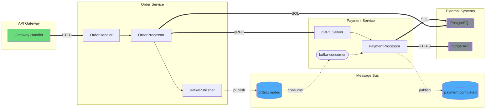

# Service Flow Generation Prompt

## Overview

Generate a service flow diagram showing **both sync (gRPC/HTTP) and async (Kafka/queues)** communication between services. The distinction between sync and async is **critical** for incident investigation and onboarding.

## CRITICAL: Arrow Style Rules

**You MUST use the correct arrow style. This is non-negotiable.**

| Communication Type | Arrow Syntax | When to Use |
|-------------------|--------------|-------------|
| **Sync (gRPC/HTTP)** | `==>` | gRPC calls, HTTP requests, REST APIs, direct DB queries |
| **Async (Kafka/Queue)** | `-.->` | Kafka, RabbitMQ, SQS, Redis pub/sub, any message queue |
| **Internal (same service)** | `-->` | Function calls within the same service boundary |

**Why this matters:**
- Sync: Caller is BLOCKED waiting for response. Timeout = immediate failure.
- Async: Caller continues immediately. Failure is delayed, shows up as lag or DLQ.

## Steps

### 1. Identify Service Boundaries

Scan for:
- Directory structure: `services/payment/`, `cmd/order-service/`
- Go modules: `module github.com/company/payment-service`
- Python packages: separate `requirements.txt` or `pyproject.toml`
- Kubernetes/Docker: `deployment.yaml`, `Dockerfile`
- Proto files: `service PaymentService { ... }`

### 2. Identify Sync Communication (gRPC/HTTP)

#### Go gRPC Patterns
```go
// Client creation
conn, err := grpc.Dial(address, opts...)
client := pb.NewPaymentServiceClient(conn)

// Calling another service (THIS IS SYNC - use ==>)
response, err := client.ProcessPayment(ctx, request)
```

#### Go HTTP Patterns
```go
// HTTP client calls (THIS IS SYNC - use ==>)
resp, err := http.Get("http://other-service/api/...")
resp, err := client.Do(req)
```

#### Python gRPC Patterns
```python
# Client creation
channel = grpc.insecure_channel('payment-service:50051')
stub = payment_pb2_grpc.PaymentServiceStub(channel)

# Calling another service (THIS IS SYNC - use ==>)
response = stub.ProcessPayment(request)
```

#### Python HTTP Patterns
```python
# HTTP calls (THIS IS SYNC - use ==>)
response = requests.get("http://other-service/api/...")
response = await client.get("http://other-service/api/...")
```

### 3. Identify Async Communication (Kafka/Queues)

#### Go Kafka Patterns
```go
// Sarama producer (THIS IS ASYNC - use -.->)
producer.SendMessage(&sarama.ProducerMessage{Topic: "orders"})

// Confluent producer (THIS IS ASYNC - use -.->)
p.Produce(&kafka.Message{TopicPartition: kafka.TopicPartition{Topic: &topic}})

// Consumer (receives async messages)
for msg := range claim.Messages() { ... }
```

#### Python Kafka Patterns
```python
# kafka-python (THIS IS ASYNC - use -.->)
producer.send('orders', value=data)

# Consumer
for msg in consumer:
    process(msg)

# Faust (THIS IS ASYNC - use -.->)
@app.agent(orders_topic)
async def process(orders):
    async for order in orders:
        ...
```

#### Other Async Patterns
```go
// RabbitMQ (ASYNC - use -.->)
ch.Publish(exchange, routingKey, mandatory, immediate, msg)

// Redis pub/sub (ASYNC - use -.->)
client.Publish(ctx, "channel", message)
```

### 4. Identify External Systems

Mark external dependencies distinctly:
- Databases: PostgreSQL, MySQL, MongoDB
- Caches: Redis, Memcached
- Third-party APIs: Stripe, Twilio, AWS services
- Object storage: S3, GCS

### 5. Generate Mermaid Diagram



### 6. Visual Convention Checklist

**Arrow Styles (MUST be correct):**
- [ ] `==>` for ALL gRPC calls
- [ ] `==>` for ALL HTTP/REST calls
- [ ] `==>` for ALL database queries
- [ ] `-.->` for ALL Kafka publishes
- [ ] `-.->` for ALL message queue operations
- [ ] `-->` for internal function calls only

**Node Shapes:**
- [ ] `[name]` rectangles for services/handlers
- [ ] `[(name)]` cylinders for Kafka topics
- [ ] `([name])` stadiums for consumer groups
- [ ] `[[name]]` double rectangles for external systems

**Colors:**
- [ ] Green `#69db7c` for entry points
- [ ] Blue `#4dabf7` for Kafka topics
- [ ] Purple `#be4bdb` for gRPC endpoints (optional)
- [ ] Gray `#868e96` for external systems
- [ ] Red `#ff6b6b` for DLQ/error paths
- [ ] Yellow `#ffd43b` for warnings

### 7. Always Include Legend

Every diagram MUST include this legend:

```markdown
**Legend:**
| Arrow | Meaning | Debug Approach |
|-------|---------|----------------|
| `==>` | **Sync** (gRPC/HTTP) - caller blocks | Check latency, timeouts, error codes |
| `-.->` | **Async** (Kafka) - fire & forget | Check consumer lag, DLQ, offsets |
| `-->` | Internal call | Check logs, traces |
```

### 8. Identify and Highlight Issues

#### Sync Path Issues
- **No timeout configured**: gRPC/HTTP call without deadline
- **No retry logic**: Single attempt that can fail
- **No circuit breaker**: Can cascade failures
- **Blocking in async context**: Sync call inside Kafka consumer

#### Async Path Issues
- **No DLQ**: Failed messages have nowhere to go
- **No consumer**: Topic has no subscribers
- **Single consumer**: No redundancy for critical topics
- **No idempotency**: Consumer can't handle duplicates

#### Highlight with colors:
```mermaid
%% Warning: No timeout on gRPC call
style GRPC_CALL fill:#ffd43b

%% Error: No DLQ configured
style CONSUMER fill:#ff6b6b

%% Warning: Single consumer for critical topic
style SINGLE_CONSUMER fill:#ffd43b
```

### 9. Output Structure

```markdown
# Service Flow: [Area/Feature Name]

## Diagram

\`\`\`mermaid
flowchart LR
    ...
\`\`\`

## Legend

| Arrow | Meaning | Debug Approach |
|-------|---------|----------------|
| `==>` | **Sync** (gRPC/HTTP) | Check latency, timeouts, error codes |
| `-.->` | **Async** (Kafka) | Check consumer lag, DLQ, offsets |
| `-->` | Internal | Check logs, traces |

## Communication Summary

### Sync Calls (gRPC/HTTP)
| From | To | Method | Timeout | Retry |
|------|-----|--------|---------|-------|
| OrderService | PaymentService | gRPC ProcessPayment | 5s | 3x |
| PaymentService | Stripe | HTTPS | 30s | 3x exp backoff |

### Async Messages (Kafka)
| Topic | Producers | Consumers | DLQ |
|-------|-----------|-----------|-----|
| order.created | OrderService | PaymentService, InventoryService | Yes |
| payment.completed | PaymentService | NotificationService | Yes |

## Issues Found

### Critical
- ❌ [Description of critical issue]

### Warnings
- ⚠️ [Description of warning]

## Incident Investigation Guide

### If sync path is failing:
1. Check error rates on [service] dashboard
2. Check latency percentiles
3. Verify circuit breaker state
4. Check downstream service health

### If async path is delayed:
1. Check consumer lag for [topic]
2. Check DLQ depth
3. Verify consumer group membership
4. Check for poison messages
```

### 10. Language-Specific Detection Patterns

#### Go - gRPC Client Detection
```go
// Look for these patterns - ALL ARE SYNC
grpc.Dial(
grpc.NewClient(
pb.New*Client(
client.*( // where client is a gRPC stub
```

#### Go - Kafka Detection
```go
// Look for these patterns - ALL ARE ASYNC
sarama.NewSyncProducer
sarama.NewAsyncProducer
kafka.NewProducer
producer.SendMessage
producer.Produce
sarama.NewConsumerGroup
```

#### Python - gRPC Detection
```python
# Look for these patterns - ALL ARE SYNC
grpc.insecure_channel
grpc.secure_channel
stub = *Stub(channel)
stub.*( # method calls on stub
```

#### Python - Kafka Detection
```python
# Look for these patterns - ALL ARE ASYNC
KafkaProducer
KafkaConsumer
producer.send
@app.agent # Faust
```

### 11. Proto File Analysis

When `.proto` files are present:
1. Extract service definitions to understand gRPC interface
2. Map RPC methods to actual calls in code
3. Include service methods in the diagram

```protobuf
service PaymentService {
    rpc ProcessPayment(PaymentRequest) returns (PaymentResponse);
    rpc RefundPayment(RefundRequest) returns (RefundResponse);
}
```

Maps to:
```mermaid
subgraph PaymentService [Payment Service - gRPC]
    P1[ProcessPayment]
    P2[RefundPayment]
end
```
