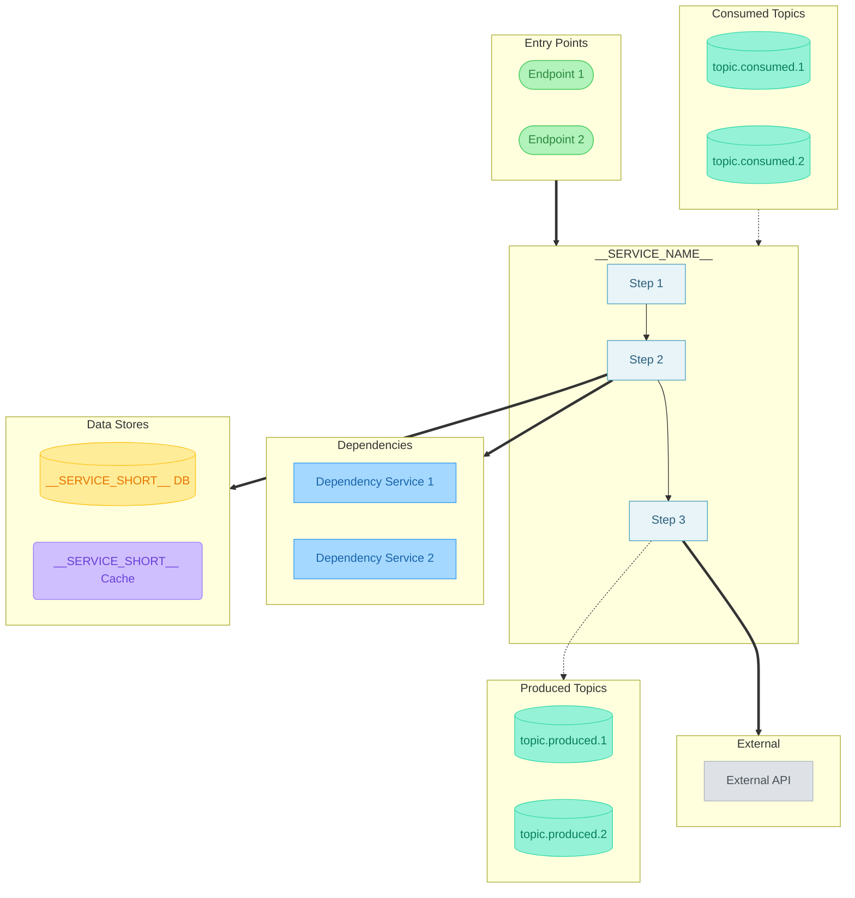

# Service Flow: __SERVICE_NAME__

> Generated: __TIMESTAMP__
> Source: __TARGET_PATH__

---

## Diagram



---

## Legend

| Symbol | Meaning |
|--------|---------|
| `==>` | **Synchronous** (gRPC/HTTP) |
| `-.->` | **Asynchronous** (Kafka) |
| `-->` | Internal call / step chain |

### Colors

| Color | Meaning |
|-------|---------|
| Blue | Services |
| Green | Entry Points |
| Teal | Kafka Topics |
| Yellow | Databases |
| Purple | Caches |
| Gray | External Systems |
| Light Blue | Internal Steps |

---

## Sync Dependencies

| From | To | Type | Source |
|------|-----|------|--------|
| _fill from .flow-deps.yaml_ | | | |

---

## Async Dependencies

| Topic | Direction | Source |
|-------|-----------|--------|
| _fill from .flow-deps.yaml_ | | |

---

## Source References

All dependencies traced from:

- _list source files from .flow-deps.yaml_

---

## Render Commands

```bash
# PNG - high resolution (for documentation)
npx -p @mermaid-js/mermaid-cli mmdc -i flow-diagram.md -o flow-diagram.png -b white -w 3840 -s 2

# SVG (for web, scalable)
npx -p @mermaid-js/mermaid-cli mmdc -i flow-diagram.md -o flow-diagram.svg -b white
```
