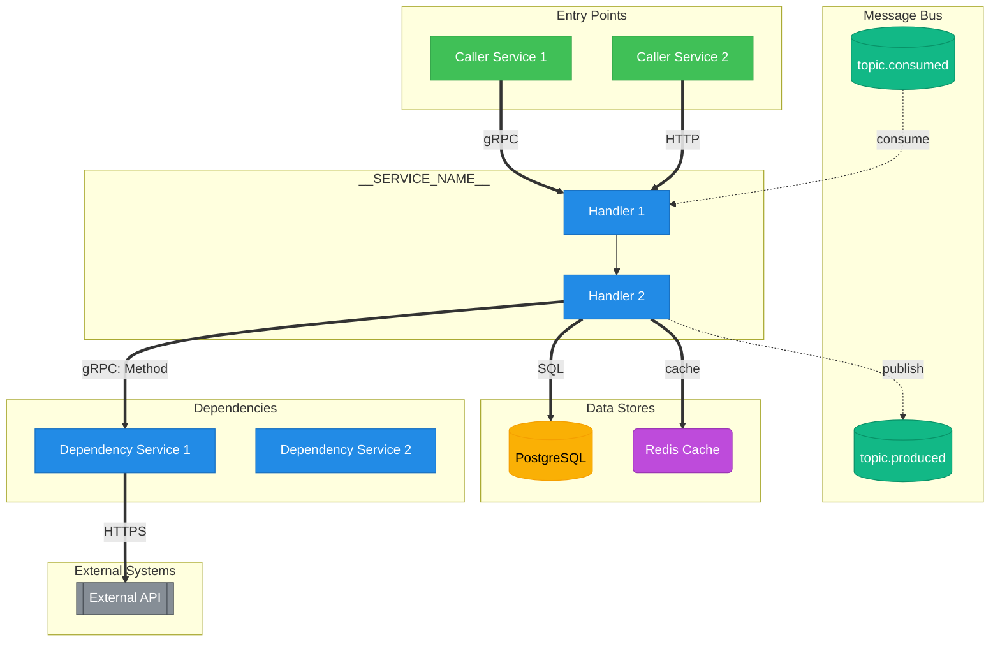

# Service Flow: __SERVICE_NAME__

> Generated: __TIMESTAMP__
> Source: __TARGET_PATH__

---

## Diagram



---

## Legend

| Symbol | Meaning | Debug Approach |
|--------|---------|----------------|
| `==>` | **Synchronous** (gRPC/HTTP) - caller blocks | Check latency, timeouts, error codes |
| `-.->` | **Asynchronous** (Kafka) - fire and forget | Check consumer lag, DLQ, offsets |
| `-->` | Internal call | Check logs, traces |

### Node Shapes

| Shape | Meaning | Syntax |
|-------|---------|--------|
| Rectangle | Service, Handler | `[Name]` |
| Cylinder | Database, Kafka Topic | `[(Name)]` |
| Stadium | Consumer Group | `([Name])` |
| Double Rectangle | External System | `[[Name]]` |
| Rounded | Cache | `(Name)` |

### Colors

| Color | Meaning |
|-------|---------|
| Blue | Services |
| Green | Entry Points |
| Teal | Kafka Topics |
| Yellow | Databases |
| Purple | Caches |
| Gray | External Systems |

---

## Sync Dependencies

| From | To | Type | Method/Endpoint | Timeout | Retry | Source |
|------|-----|------|-----------------|---------|-------|--------|
| _fill from .flow-deps.yaml_ | | | | | | |

---

## Async Dependencies

| Topic | Direction | Consumer Group | DLQ | Source |
|-------|-----------|----------------|-----|--------|
| _fill from .flow-deps.yaml_ | | | | |

---

## Source References

All dependencies traced from:

- _list source files from .flow-deps.yaml_

---

## Render Commands

```bash
# PNG (for documentation)
mmdc -i flow-diagram.md -o flow-diagram.png -b white -w 1920 -H 1080

# SVG (for web)
mmdc -i flow-diagram.md -o flow-diagram.svg -b white
```
